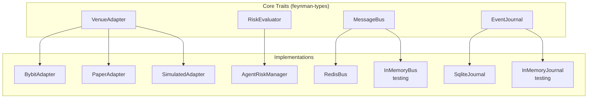
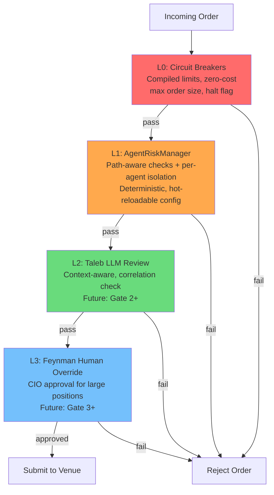
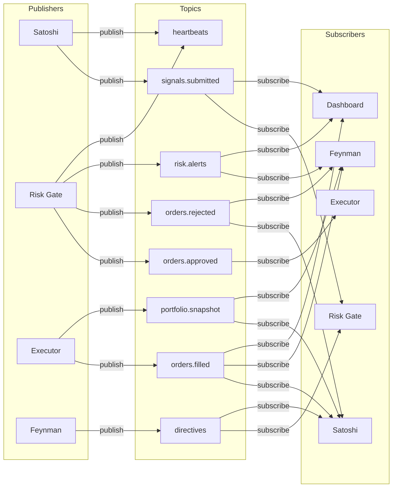
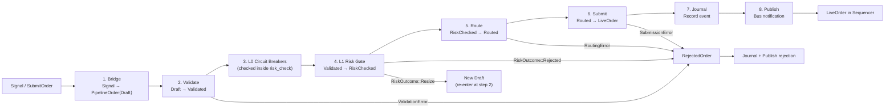
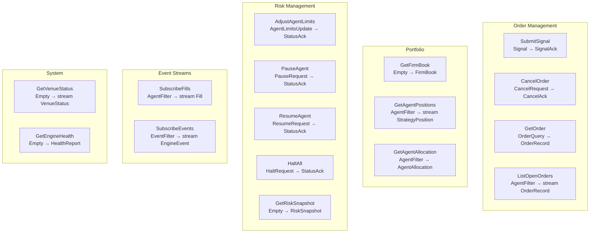
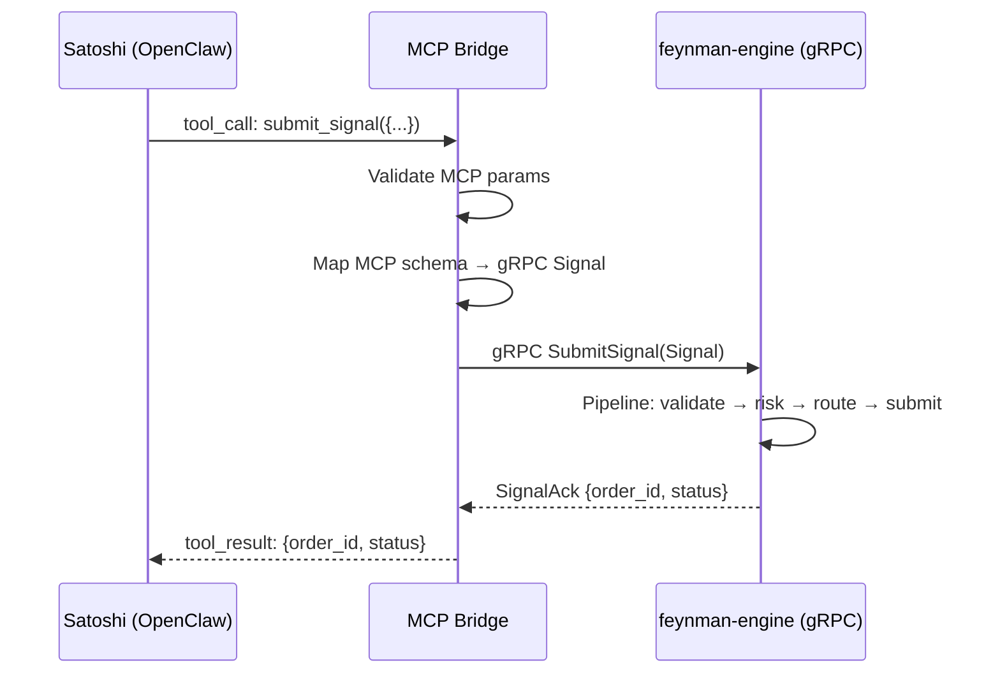

# Feynman Engine — Contracts & Interfaces

**Version:** 2.1.0
**Last Updated:** 2026-03-19

This document defines every trait, interface, and protocol boundary in the engine. Code to these contracts; implementations are swappable.

---

## 1. Trait Map



---

## 2. VenueAdapter Trait

The abstraction over all exchange interactions. One implementation per venue. **Sealed trait** — external crates cannot implement it. "Dumb adapter" principle: translation only, no business logic.

```rust
/// Contract for all venue interactions.
///
/// - Sealed: only engine crates can implement this.
/// - All operations respect `timeout_policy()` — every async call has a deadline.
/// - Connection health is reported via `connection_health()` — gateway checks
///   `is_submittable()` before routing.
/// - Accepts `OrderSubmission` (evolves to `PipelineOrder<Routed>` in Phase 1).
#[async_trait]
pub trait VenueAdapter: Send + Sync + sealed::Sealed {
    fn venue_id(&self) -> &VenueId;

    /// Current connection health. Gateway checks `is_submittable()` before routing.
    /// On `Stale` or `Disconnected`, submission returns `VenueNotConnected`.
    fn connection_health(&self) -> &VenueConnectionHealth;

    /// Per-venue timeout budgets. See DATA_MODEL.md §13.
    fn timeout_policy(&self) -> &TimeoutPolicy;

    /// Venue capabilities (supported order types, TIF, amendments).
    fn capabilities(&self) -> &VenueCapabilities;

    /// Submit an order. Must check `dry_run` flag before sending to exchange.
    /// Idempotent on `client_order_id`.
    async fn submit_order(&self, submission: OrderSubmission) -> Result<VenueOrderAck>;

    async fn cancel_order(&self, venue_order_id: &VenueOrderId) -> Result<()>;

    async fn amend_order(
        &self,
        venue_order_id: &VenueOrderId,
        new_price: Option<Decimal>,
        new_qty: Option<Decimal>,
    ) -> Result<VenueOrderAck>;

    async fn query_positions(&self) -> Result<Vec<VenuePosition>>;
    async fn query_open_orders(&self) -> Result<Vec<VenueOpenOrder>>;
    async fn query_balance(&self) -> Result<VenueBalance>;

    /// Subscribe to fill stream. **Bounded** channel — capacity set per adapter.
    async fn subscribe_fills(&self) -> Result<mpsc::Receiver<VenueFill>>;

    async fn connect(&mut self) -> Result<()>;
    async fn disconnect(&mut self) -> Result<()>;
}
```

### VenueAdapter Response Types

```rust
pub struct VenueOrderAck {
    pub venue_order_id: VenueOrderId,
    pub client_order_id: ClientOrderId,
    pub accepted_at: DateTime<Utc>,
}

pub struct VenueFill {
    pub venue_order_id: VenueOrderId,
    pub client_order_id: ClientOrderId,
    pub instrument_id: InstrumentId,
    pub side: Side,
    pub qty: Decimal,
    pub price: Decimal,
    pub fee: Decimal,
    pub is_maker: bool,
    pub filled_at: DateTime<Utc>,
}

pub struct VenueBalance {
    pub total_equity: Decimal,
    pub available_balance: Decimal,
    pub margin_used: Decimal,
    pub unrealized_pnl: Decimal,
    pub as_of: DateTime<Utc>,
}
```

### Connection Health (see DATA_MODEL.md §13 for full types)

`VenueConnectionHealth` tracks `ConnectionState` (6 variants), heartbeat latency, and reconnect count. `is_submittable()` returns true only in `Connected` state. On `Stale` → reconciliation is triggered on next reconnect. Heartbeat configuration via `HeartbeatConfig` (interval, warning threshold, stale threshold).

### Timeout Policy (see DATA_MODEL.md §13 for full types)

`TimeoutPolicy` defines per-operation deadlines: `submit_order` (10s), `cancel_order` (10s), `query_*` (15s), `fill_watchdog` (60s). On timeout: `ReconcileAndDecide` — never blind retry.

### Capability Extensions

Not all venues support all features. Use marker traits:

```rust
/// Venue supports amending orders in-place (Bybit, Binance).
/// Gateway checks `adapter.as_amendable().is_some()` before attempting amend.
pub trait AmendableVenue: VenueAdapter {
    async fn amend_order(&self, venue_order_id: &VenueOrderId, amend: &OrderAmend)
        -> Result<VenueOrderAck>;
}

/// Venue supports WebSocket streaming (most CEXs). All channels bounded.
pub trait StreamingVenue: VenueAdapter {
    fn subscribe_orderbook(&self, instrument: &InstrumentId, depth: u32)
        -> mpsc::Receiver<OrderBookUpdate>;
    fn subscribe_trades(&self, instrument: &InstrumentId)
        -> mpsc::Receiver<PublicTrade>;
}

/// Venue supports funding rate queries (perpetual venues).
pub trait FundingVenue: VenueAdapter {
    async fn get_funding_rate(&self, instrument: &InstrumentId) -> Result<FundingRate>;
    fn subscribe_funding(&self) -> mpsc::Receiver<FundingRate>;
}
```

---

## 3. RiskGate / RiskEvaluator Traits

Synchronous, stateful risk evaluation. Receives `PriceSource` for mark-to-market drawdown checks.

```rust
/// Stateful risk evaluation. Knows current firm book. Hot-reloadable limits.
/// All time-dependent checks receive `now` from Clock, never Utc::now().
pub trait RiskGate: Send + Sync {
    /// Evaluate order against all risk limits.
    /// `prices`: sync cache for mark-to-market risk checks (drawdown, NAV).
    /// `now`: from Sequencer's Clock::now() — deterministic in backtest.
    fn evaluate(
        &self,
        order: &CanonicalOrder,
        prices: &dyn PriceSource,
        now: DateTime<Utc>,
    ) -> std::result::Result<RiskApproval, Vec<RiskViolation>>;

    fn firm_book(&self) -> &FirmBook;
    fn update_limits(&mut self, limits: RiskLimits);
    fn on_fill(&mut self, fill: &Fill, now: DateTime<Utc>);
    fn on_position_corrected(&mut self, instrument: &InstrumentId, new_qty: Decimal, now: DateTime<Utc>);
    fn current_limits(&self) -> &RiskLimits;
}

/// Result of risk evaluation. Three outcomes — not two.
pub enum RiskOutcome {
    Approved { warnings: Vec<RiskViolation> },
    Resized { new_qty: Decimal, reason: String, warnings: Vec<RiskViolation> },
    Rejected { violations: Vec<RiskViolation> },
}
```

The `RiskEvaluator` (Phase 1 type-state variant) will accept `PipelineOrder<Validated>` and advance to `PipelineOrder<RiskChecked>`. See DATA_MODEL.md §3.2 for the full type definitions and resize loop semantics.

### Risk Checklist (AgentRiskManager)

The first `RiskEvaluator` implementation. Pure arithmetic, zero latency.
Path-aware: universal checks apply to all order paths; signal-specific checks
apply only to `SubmitSignal` (where the engine owns sizing).

```rust
/// Risk checks split by ingress path.
/// Universal checks run on every order. Signal-specific checks only on SubmitSignal.
pub struct RiskChecklist;

impl RiskChecklist {
    // ── Universal checks (all paths: SubmitSignal, SubmitOrder, SubmitBatch) ──

    /// Check 1: Position notional <= 5% of total NAV.
    pub fn check_position_size(order: &Order, firm_book: &FirmBook) -> CheckResult;

    /// Check 2: Max loss on this position <= 1% of total NAV.
    /// If stop_loss present: max_loss = qty * |entry - stop_loss|
    /// If stop_loss absent: max_loss = notional (worst case)
    pub fn check_account_risk(order: &Order, firm_book: &FirmBook) -> CheckResult;

    /// Check 3: Total leverage within agent limits.
    /// gross_notional / allocated_capital <= max_leverage
    pub fn check_leverage(
        order: &Order,
        agent_limits: &AgentRiskLimits,
        current_gross: Decimal,
    ) -> CheckResult;

    /// Check 4: Agent drawdown within threshold.
    /// (realized_pnl + unrealized_pnl) / allocated_capital > -max_drawdown_pct
    pub fn check_drawdown(agent_allocation: &AgentAllocation) -> CheckResult;

    /// Check 5: Free capital >= 20% of total NAV after this order.
    /// (firm_book.free_capital - order.notional) / firm_book.total_nav >= 0.20
    pub fn check_cash_reserve(order: &Order, firm_book: &FirmBook) -> CheckResult;

    // ── Signal-specific checks (SubmitSignal only — engine owns sizing) ──

    /// Check 6: Signal must define a stop loss.
    /// Required because the engine needs a defined exit to calculate position size.
    /// NOT required for SubmitOrder/SubmitBatch (strategies manage their own exits).
    pub fn check_stop_loss_defined(signal: &Signal) -> CheckResult;

    /// Check 7: Risk/reward ratio >= 2:1 (when both stop_loss and take_profit present).
    /// (take_profit - entry) / (entry - stop_loss) >= 2.0
    pub fn check_risk_reward(signal: &Signal) -> CheckResult;
}

pub enum CheckResult {
    Pass,
    Resize { max_notional: Decimal, reason: String },
    Fail { violation: RiskViolation },
}
```

### Risk Layer Stack



| Layer | Implementation | Latency | When |
|-------|---------------|---------|------|
| L0 | Compiled constants | <1μs | Phase 0 (now) |
| L1 | `AgentRiskManager` (configurable) | <1ms | Phase 0 (now) |
| L2 | Taleb LLM agent via gRPC callback | ~2s | Gate 2 |
| L3 | Feynman human via dashboard approval | async | Gate 3 |

---

## 4. MessageBus Trait

Cross-process event bus for agent coordination.

```rust
/// Message bus contract. Implementations provide pub/sub with consumer groups
/// and at-least-once delivery guarantees.
#[async_trait]
pub trait MessageBus: Send + Sync {
    /// Publish a message to a topic.
    async fn publish(&self, topic: &str, payload: &BusMessage) -> Result<MessageId>;

    /// Subscribe to a topic as part of a consumer group.
    /// Messages are distributed across consumers in the same group.
    /// Returns a bounded stream of messages (capacity set per subscription).
    async fn subscribe(
        &self,
        topic: &str,
        group: &str,
        consumer: &str,
    ) -> Result<mpsc::Receiver<BusEnvelope>>;

    /// Acknowledge that a message has been processed.
    /// Prevents redelivery to the same consumer group.
    async fn ack(&self, topic: &str, group: &str, message_id: &MessageId) -> Result<()>;

    /// List messages that have been delivered but not acknowledged.
    /// Used for stuck message detection and recovery.
    async fn pending(
        &self,
        topic: &str,
        group: &str,
        min_idle_ms: u64,
    ) -> Result<Vec<PendingMessage>>;

    /// Claim a stuck message from another consumer in the same group.
    /// Used for crash recovery.
    async fn claim(
        &self,
        topic: &str,
        group: &str,
        consumer: &str,
        message_ids: &[MessageId],
    ) -> Result<Vec<BusEnvelope>>;
}
```

### Bus Message Envelope

```rust
/// Every message on the bus is wrapped in this envelope.
/// The envelope provides routing, versioning, and traceability.
pub struct BusEnvelope {
    pub id: MessageId,
    pub topic: String,
    pub publisher: AgentId,
    pub schema_version: String,     // e.g., "1.0"
    pub correlation_id: Option<String>,
    pub payload: BusMessage,
    pub published_at: DateTime<Utc>,
    pub ttl_days: Option<u32>,
}

/// Typed message payloads. Each variant maps to a bus topic.
pub enum BusMessage {
    SignalSubmitted(Signal),
    OrderApproved(OrderApproval),
    OrderRejected(OrderRejection),
    OrderFilled(FillEvent),
    PortfolioSnapshot(FirmBook),
    RiskAlert(RiskViolation),
    Directive(AgentDirective),
    Heartbeat(AgentHeartbeat),
}
```

### Topic Registry



---

## 5. EventJournal Trait

Append-only event log for crash recovery, audit, and replay. Events are wrapped in `SequencedEvent<EngineEvent>` (monotonic ID + clock timestamp + payload). See DATA_MODEL.md §11.

```rust
/// Append-only event journal. Events are stored with their SequenceId.
/// On restart: load_latest_snapshot → replay_from(snapshot_sequence_id + 1).
/// Not on the hot path — Sequencer processes first, journals after.
/// If journal is slow → events buffer in memory (BufferAndContinue policy).
#[async_trait]
pub trait EventJournal: Send + Sync {
    async fn append(&self, event: &SequencedEvent<EngineEvent>) -> Result<()>;
    async fn append_batch(&self, events: &[SequencedEvent<EngineEvent>]) -> Result<()>;

    /// Replay events from sequence ID (inclusive), in order.
    async fn replay_from(&self, from: SequenceId) -> Result<Vec<SequencedEvent<EngineEvent>>>;
    async fn replay_range(&self, from: SequenceId, to: SequenceId)
        -> Result<Vec<SequencedEvent<EngineEvent>>>;

    async fn save_snapshot(&self, seq: SequenceId, snapshot: &EngineStateSnapshot) -> Result<()>;
    async fn load_latest_snapshot(&self)
        -> Result<Option<(SequenceId, EngineStateSnapshot)>>;
    async fn latest_sequence_id(&self) -> Result<SequenceId>;
}
```

`EngineEvent` is a 22-variant enum covering the full engine lifecycle. See `types/src/event.rs` for the canonical definitions. The `SequenceGenerator` (owned by Sequencer) assigns `SequenceId` values and resumes from the highest journaled ID on startup.

## 5a. Reconciler Trait

Queries venue state and produces `ReconciliationReport`s for the Sequencer. The Sequencer is the only entity that corrects state.

```rust
/// Queries venue for positions, orders, and balances.
/// Compares against engine snapshot. Sends report to Sequencer.
/// Does NOT mutate engine state — only the Sequencer does that.
#[async_trait]
pub trait Reconciler: Send + Sync {
    async fn reconcile(
        &self,
        venue_id: &VenueId,
        engine_snapshot: &EngineStateSnapshot,
    ) -> Result<ReconciliationReport>;
}
```

`ReconciliationReport` contains `Vec<PositionDivergence>`, `Vec<OrderDivergence>`, and `Option<BalanceDivergence>`. See DATA_MODEL.md §7 for full type definitions. The Sequencer processes the report via `SequencerCommand::OnReconciliation`.

---

## 6. Order Pipeline (Type-State + Runtime)

The pipeline is **not** a list of generic `PipelineStage` trait objects. It is a **fixed sequence of typed transitions** enforced by the type system. Each stage consumes the previous type and produces the next. This makes the pipeline order a compile-time guarantee, not a runtime convention.

See DATA_MODEL.md §3 for the full type definitions.

### Pipeline Flow



### Type-State Guarantees

| Stage | Input Type | Output Type | What it proves |
|-------|-----------|------------|---------------|
| Bridge | `Signal` or `OrderRequest` | `PipelineOrder<Draft>` | Structured order created |
| Validate | `PipelineOrder<Draft>` | `PipelineOrder<Validated>` | Qty > 0, price valid, venue supports order type |
| Risk Check | `PipelineOrder<Validated>` | `PipelineOrder<RiskChecked>` + `RiskProof` | Risk gate approved, per-agent limits checked |
| Route | `PipelineOrder<RiskChecked>` | `PipelineOrder<Routed>` | Venue selected, adapter resolved |
| Submit | `PipelineOrder<Routed>` | `LiveOrder` | On venue, runtime FSM begins |

**Key design choice:** The pipeline is not extensible via a trait. Adding a new stage requires a new type-state marker and a new consuming method — a deliberate code change with a compile-time impact on every call site. This is intentional for safety-critical infrastructure.

### Resize Loop

When the risk gate returns `RiskOutcome::Resize`, the order re-enters the pipeline as a new `PipelineOrder<Draft>` with adjusted qty/notional. The loop is bounded: if the resized order is still rejected, it becomes a `RejectedOrder`. No infinite resize cycles.

```rust
/// Pseudocode for the resize loop inside the Sequencer.
fn process_through_pipeline(draft: PipelineOrder<Draft>) -> Result<LiveOrder, RejectedOrder> {
    let validated = draft.validate(&caps)?;
    match risk_gate.evaluate(validated, &limits, &firm_book) {
        RiskOutcome::Approved(checked, proof) => {
            let routed = checked.route(&registry, &symbol_map)?;
            routed.submit(&adapter).await
        }
        RiskOutcome::Resize { resized, .. } => {
            // One retry with resized qty. If this also fails → reject.
            let validated = resized.validate(&caps)?;
            match risk_gate.evaluate(validated, &limits, &firm_book) {
                RiskOutcome::Approved(checked, proof) => {
                    let routed = checked.route(&registry, &symbol_map)?;
                    routed.submit(&adapter).await
                }
                _ => Err(RejectedOrder { reason: ResizeStillExceedsLimits, .. })
            }
        }
        RiskOutcome::Rejected(rejected) => Err(rejected),
    }
}
```

---

## 7. gRPC Service Contract

Defined in `proto/feynman/engine/v1/service.proto`:

### Service Methods



### Auth Model

The gRPC service authenticates callers by agent identity (passed as metadata). Each RPC has an access control rule:

| RPC | Allowed Callers | Notes |
|-----|----------------|-------|
| `SubmitSignal` | Any trader agent (satoshi, graham, soros...) | Signal is attributed to caller |
| `CancelOrder` | Agent that submitted the order | Cannot cancel another agent's order |
| `GetOrder` | Agent that submitted, or Feynman/Taleb | Read access for oversight |
| `GetFirmBook` | Any authenticated agent | Read-only firm state |
| `AdjustAgentLimits` | Feynman only | CIO privilege |
| `PauseAgent` | Feynman, Taleb | CIO or risk officer |
| `HaltAll` | Feynman only | CIO privilege |

---

## 8. MCP-gRPC Bridge Contract

The bridge is a thin Node.js process that translates MCP tool calls (from OpenClaw agents) into gRPC requests (to the engine). It runs alongside the OpenClaw gateway.

### Bridge Architecture



### MCP Tool → gRPC Mapping

| MCP Tool (current) | gRPC RPC (engine) | Direction |
|--------------------|--------------------|-----------|
| `bus_publish("orders.submitted", signal)` | `SubmitSignal(Signal)` | Agent → Engine |
| `executor.get_portfolio_state()` | `GetFirmBook()` | Agent → Engine |
| `executor.get_trade_metrics()` | `GetRiskSnapshot()` | Agent → Engine |
| `bus_subscribe("orders.filled")` | `SubscribeFills(filter)` | Engine → Agent (stream) |
| `bus_subscribe("orders.approved")` | `SubscribeEvents(filter)` | Engine → Agent (stream) |
| Taleb: `executor.execute_order(order)` | `SubmitSignal` + internal risk gate | Agent → Engine |

**Critical migration note:** In the trading bot, Taleb calls `execute_order` directly. In the engine, Taleb's approval is encoded in the risk layer. The MCP bridge must map Taleb's `execute_order` call to the engine's `SubmitSignal` with a risk-pre-approved flag (the engine's L1 risk gate has already run by this point; Taleb acts as L2).

---

## 9. Dashboard REST/WebSocket Contract

### REST Endpoints

| Method | Path | Response | Notes |
|--------|------|----------|-------|
| GET | `/health` | `HealthReport` | Engine health + venue status |
| GET | `/portfolio` | `FirmBook` | Current firm-wide state |
| GET | `/portfolio/agents/:id` | `AgentAllocation` | Per-agent view |
| GET | `/positions` | `Vec<TrackedPosition>` | All open positions |
| GET | `/positions/:agent_id` | `Vec<TrackedPosition>` | Agent's positions |
| GET | `/risk/snapshot` | `RiskSnapshot` | Current risk state + recent violations |
| GET | `/risk/limits` | Config JSON | Current risk limits (all layers) |
| GET | `/orders/open` | `Vec<OrderRecord>` | All open orders |
| GET | `/orders/:id` | `OrderRecord` | Single order detail |
| GET | `/metrics` | Prometheus text | Prometheus scrape endpoint |

### WebSocket Events

| Channel | Event | Payload |
|---------|-------|---------|
| `/ws/fills` | `fill` | `VenueFill` |
| `/ws/orders` | `order_update` | `OrderStatusUpdate` |
| `/ws/risk` | `risk_alert` | `RiskViolation` |
| `/ws/portfolio` | `snapshot` | `FirmBook` (periodic, every 30s) |

---

## 10. Configuration Contract

```toml
# config/default.toml — canonical structure

[engine]
execution_mode = "paper"     # "backtest" | "paper" | "live"
dry_run = true               # MUST be true unless explicitly live
grpc_port = 50051
dashboard_port = 8080
log_level = "info"

[redis]
url = "redis://localhost:6379"
max_connections = 10

[risk.firm]
max_gross_notional = 200000
max_net_notional = 100000
max_drawdown_pct = 5.0
max_daily_loss = 5000
max_open_orders = 50

[risk.agents.satoshi]
allocated_capital = 50000
max_position_notional = 25000
max_gross_notional = 50000
max_drawdown_pct = 3.0
max_daily_loss = 1500
max_open_orders = 10
allowed_instruments = ["BTCUSDT", "ETHUSDT"]
allowed_venues = ["bybit"]

[risk.instruments.BTCUSDT]
max_net_qty = 1.0
max_gross_qty = 2.0
max_concentration_pct = 40.0

[risk.instruments.ETHUSDT]
max_net_qty = 20.0
max_gross_qty = 40.0
max_concentration_pct = 30.0

[risk.venues.bybit]
max_notional = 200000
max_positions = 50

[venues.bybit]
testnet = true
api_key = "${BYBIT_API_KEY}"
api_secret = "${BYBIT_API_SECRET}"

[shutdown]
drain_timeout_secs = 30
cancel_pending_on_shutdown = true
snapshot_on_shutdown = true
```

### Hot-Reloadable Sections

| Section | Hot-Reload | Mechanism |
|---------|-----------|-----------|
| `[risk.firm]` | Yes | SIGHUP or bus directive `reload_risk_config` |
| `[risk.agents.*]` | Yes | Via `AdjustAgentLimits` gRPC |
| `[risk.instruments.*]` | Yes | SIGHUP |
| `[risk.venues.*]` | Yes | SIGHUP |
| `[engine]` | No | Requires restart |
| `[venues.*]` | No | Requires restart (reconnection) |
