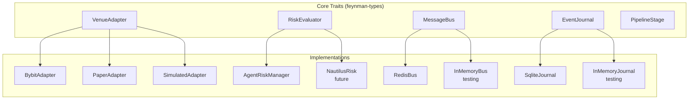
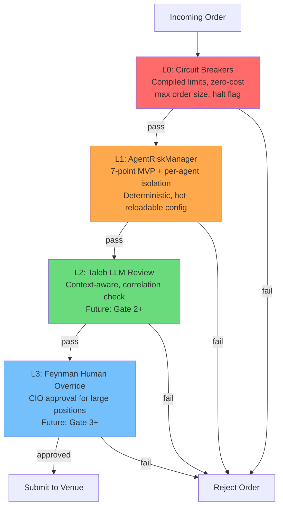
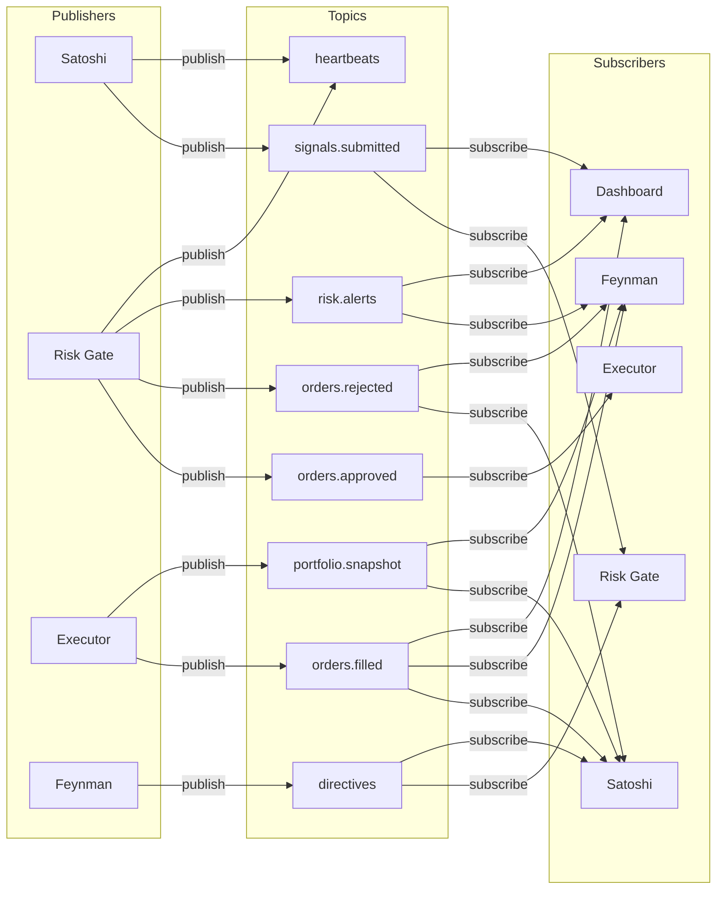
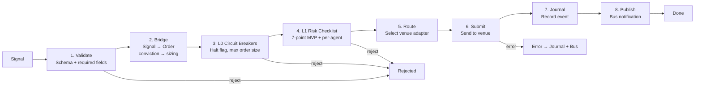
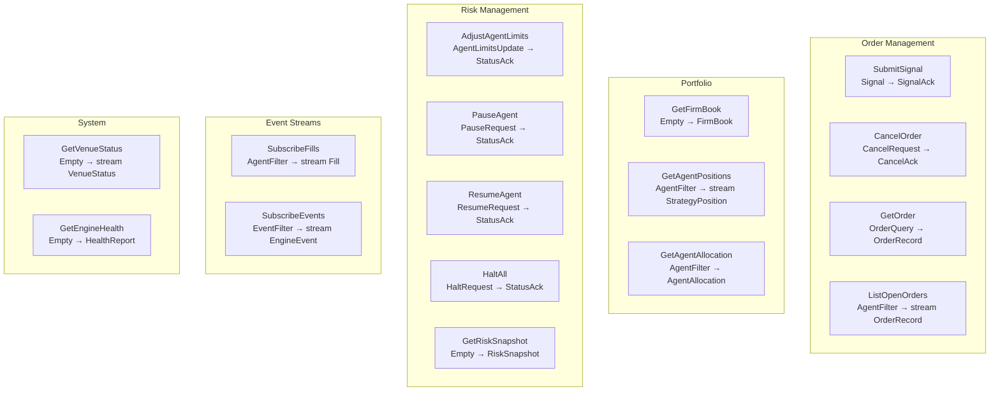
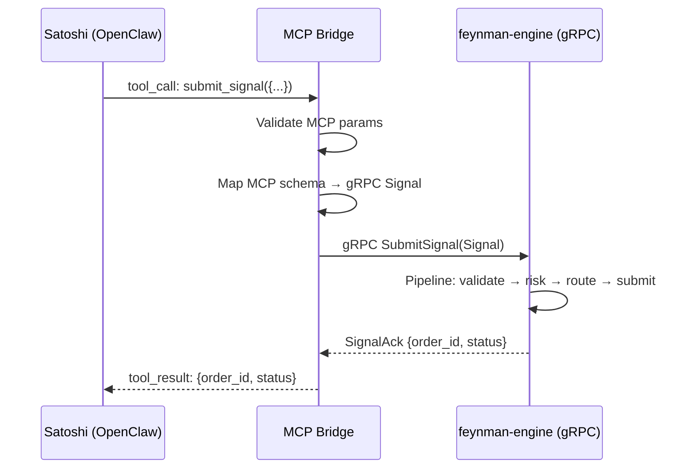

# Feynman Engine — Contracts & Interfaces

**Version:** 2.0.0
**Last Updated:** 2026-03-17

This document defines every trait, interface, and protocol boundary in the engine. Code to these contracts; implementations are swappable.

---

## 1. Trait Map



---

## 2. VenueAdapter Trait

The abstraction over all exchange interactions. One implementation per venue.

```rust
/// Contract for all venue interactions.
/// Implementations handle venue-native API translation, authentication,
/// rate limiting, and WebSocket management.
#[async_trait]
pub trait VenueAdapter: Send + Sync {
    /// Unique identifier for this venue (e.g., "bybit", "binance").
    fn venue_id(&self) -> &VenueId;

    /// Submit an order to the venue. Returns venue's order ID on success.
    /// Must check dryRun before actually submitting.
    /// Must be idempotent on `order.client_order_id`.
    async fn submit_order(&self, order: &Order) -> Result<VenueOrderAck>;

    /// Cancel an order by its venue order ID.
    async fn cancel_order(&self, venue_order_id: &VenueOrderId) -> Result<CancelAck>;

    /// Amend an existing order (price/qty). Not all venues support this.
    async fn amend_order(&self, venue_order_id: &VenueOrderId, amend: &OrderAmend)
        -> Result<VenueOrderAck>;

    /// Query the status of an order.
    async fn get_order_status(&self, venue_order_id: &VenueOrderId) -> Result<OrderStatus>;

    /// List all open orders, optionally filtered by instrument.
    async fn list_open_orders(&self, instrument: Option<&InstrumentId>)
        -> Result<Vec<OrderStatus>>;

    /// Get current positions on the venue.
    async fn get_positions(&self) -> Result<Vec<VenuePosition>>;

    /// Get account balance.
    async fn get_balance(&self) -> Result<VenueBalance>;

    /// Subscribe to fill events. Returns a stream of fills as they occur.
    async fn subscribe_fills(&self) -> Result<mpsc::UnboundedReceiver<VenueFill>>;

    /// Subscribe to order status updates.
    async fn subscribe_order_updates(&self) -> Result<mpsc::UnboundedReceiver<OrderStatusUpdate>>;

    /// Health check. Returns connection status and latency.
    async fn health_check(&self) -> VenueHealth;

    /// Graceful shutdown. Cancel pending orders if configured.
    async fn shutdown(&self, cancel_pending: bool) -> Result<()>;
}
```

### VenueAdapter Response Types

```rust
/// Acknowledgment from venue after order submission.
pub struct VenueOrderAck {
    pub venue_order_id: VenueOrderId,
    pub client_order_id: ClientOrderId,
    pub status: VenueOrderStatus,
    pub timestamp: DateTime<Utc>,
}

pub enum VenueOrderStatus {
    Accepted,
    Rejected { reason: String },
    PartiallyFilled { filled_qty: Decimal, remaining_qty: Decimal },
    Filled { filled_qty: Decimal },
    Cancelled,
}

pub struct VenueFill {
    pub venue_order_id: VenueOrderId,
    pub client_order_id: ClientOrderId,
    pub instrument: InstrumentId,
    pub side: Side,
    pub qty: Decimal,
    pub price: Decimal,
    pub fee: Decimal,
    pub fee_currency: String,
    pub is_maker: bool,
    pub timestamp: DateTime<Utc>,
}

pub struct VenueHealth {
    pub venue: VenueId,
    pub connected: bool,
    pub latency_ms: Option<u32>,
    pub last_heartbeat: Option<DateTime<Utc>>,
}
```

### Capability Extensions

Not all venues support all features. Use marker traits:

```rust
/// Venue supports amending orders in-place (Bybit, Binance).
pub trait AmendableVenue: VenueAdapter {
    async fn amend_order(&self, ...) -> Result<VenueOrderAck>;
}

/// Venue supports WebSocket streaming (most CEXs).
pub trait StreamingVenue: VenueAdapter {
    async fn subscribe_orderbook(&self, instrument: &InstrumentId, depth: u32)
        -> Result<mpsc::UnboundedReceiver<OrderBookUpdate>>;
    async fn subscribe_trades(&self, instrument: &InstrumentId)
        -> Result<mpsc::UnboundedReceiver<PublicTrade>>;
}

/// Venue supports funding rate queries (perpetual venues).
pub trait FundingVenue: VenueAdapter {
    async fn get_funding_rate(&self, instrument: &InstrumentId) -> Result<FundingRate>;
    async fn subscribe_funding(&self) -> Result<mpsc::UnboundedReceiver<FundingRate>>;
}
```

---

## 3. RiskEvaluator Trait

Pure, synchronous, deterministic risk evaluation. No I/O.

```rust
/// Risk evaluation contract. Implementations must be deterministic:
/// same inputs always produce the same output.
pub trait RiskEvaluator: Send + Sync {
    /// Evaluate an order against risk limits and portfolio state.
    /// Returns approval with optional resizing, or a list of violations.
    fn evaluate(
        &self,
        order: &Order,
        agent_limits: &AgentRiskLimits,
        firm_book: &FirmBook,
    ) -> RiskDecision;
}

/// Result of risk evaluation. An order is either approved (possibly resized)
/// or rejected with specific violations.
pub enum RiskDecision {
    /// Order approved as-is.
    Approved,
    /// Order approved but resized to fit within limits.
    Resized {
        original_notional: Decimal,
        approved_notional: Decimal,
        reason: String,
    },
    /// Order rejected. Contains all violations found (not just the first).
    Rejected {
        violations: Vec<RiskViolation>,
    },
}
```

### MVP 7-Point Checklist (AgentRiskManager)

The first `RiskEvaluator` implementation. Pure arithmetic, zero latency.

```rust
/// The 7 mandatory checks, in order. All must pass for approval.
/// If a check fails as "soft" (e.g., size too large), the order may be
/// resized rather than rejected.
pub struct MvpRiskChecklist;

impl MvpRiskChecklist {
    /// Check 1: Signal must define a stop loss.
    pub fn check_stop_loss_defined(order: &Order) -> CheckResult;

    /// Check 2: Risk/reward ratio >= 2:1.
    /// (take_profit - entry) / (entry - stop_loss) >= 2.0
    pub fn check_risk_reward(order: &Order) -> CheckResult;

    /// Check 3: Position notional <= 5% of total NAV.
    pub fn check_position_size(order: &Order, firm_book: &FirmBook) -> CheckResult;

    /// Check 4: Max loss on this position <= 1% of total NAV.
    /// Max loss = qty * |entry - stop_loss|
    pub fn check_account_risk(order: &Order, firm_book: &FirmBook) -> CheckResult;

    /// Check 5: Total leverage within agent limits.
    /// gross_notional / allocated_capital <= max_leverage
    pub fn check_leverage(
        order: &Order,
        agent_limits: &AgentRiskLimits,
        current_gross: Decimal,
    ) -> CheckResult;

    /// Check 6: Agent drawdown < 15%.
    /// (realized_pnl + unrealized_pnl) / allocated_capital > -0.15
    pub fn check_drawdown(agent_allocation: &AgentAllocation) -> CheckResult;

    /// Check 7: Free capital >= 20% of total NAV after this order.
    /// (firm_book.free_capital - order.notional) / firm_book.total_nav >= 0.20
    pub fn check_cash_reserve(order: &Order, firm_book: &FirmBook) -> CheckResult;
}

pub enum CheckResult {
    Pass,
    Resize { max_notional: Decimal, reason: String },
    Fail { violation: RiskViolation },
}
```

### Risk Layer Stack



| Layer | Implementation | Latency | When |
|-------|---------------|---------|------|
| L0 | Compiled constants | <1μs | Phase 0 (now) |
| L1 | `AgentRiskManager` (configurable) | <1ms | Phase 0 (now) |
| L2 | Taleb LLM agent via gRPC callback | ~2s | Gate 2 |
| L3 | Feynman human via dashboard approval | async | Gate 3 |

---

## 4. MessageBus Trait

Cross-process event bus for agent coordination.

```rust
/// Message bus contract. Implementations provide pub/sub with consumer groups
/// and at-least-once delivery guarantees.
#[async_trait]
pub trait MessageBus: Send + Sync {
    /// Publish a message to a topic.
    async fn publish(&self, topic: &str, payload: &BusMessage) -> Result<MessageId>;

    /// Subscribe to a topic as part of a consumer group.
    /// Messages are distributed across consumers in the same group.
    /// Returns a stream of messages.
    async fn subscribe(
        &self,
        topic: &str,
        group: &str,
        consumer: &str,
    ) -> Result<mpsc::UnboundedReceiver<BusEnvelope>>;

    /// Acknowledge that a message has been processed.
    /// Prevents redelivery to the same consumer group.
    async fn ack(&self, topic: &str, group: &str, message_id: &MessageId) -> Result<()>;

    /// List messages that have been delivered but not acknowledged.
    /// Used for stuck message detection and recovery.
    async fn pending(
        &self,
        topic: &str,
        group: &str,
        min_idle_ms: u64,
    ) -> Result<Vec<PendingMessage>>;

    /// Claim a stuck message from another consumer in the same group.
    /// Used for crash recovery.
    async fn claim(
        &self,
        topic: &str,
        group: &str,
        consumer: &str,
        message_ids: &[MessageId],
    ) -> Result<Vec<BusEnvelope>>;
}
```

### Bus Message Envelope

```rust
/// Every message on the bus is wrapped in this envelope.
/// The envelope provides routing, versioning, and traceability.
pub struct BusEnvelope {
    pub id: MessageId,
    pub topic: String,
    pub publisher: AgentId,
    pub schema_version: String,     // e.g., "1.0"
    pub correlation_id: Option<String>,
    pub payload: BusMessage,
    pub published_at: DateTime<Utc>,
    pub ttl_days: Option<u32>,
}

/// Typed message payloads. Each variant maps to a bus topic.
pub enum BusMessage {
    SignalSubmitted(Signal),
    OrderApproved(OrderApproval),
    OrderRejected(OrderRejection),
    OrderFilled(FillEvent),
    PortfolioSnapshot(FirmBook),
    RiskAlert(RiskViolation),
    Directive(AgentDirective),
    Heartbeat(AgentHeartbeat),
}
```

### Topic Registry



---

## 5. EventJournal Trait

Append-only event log for crash recovery and audit.

```rust
/// Append-only event journal. All state-changing events are journaled
/// before they take effect. On restart, replay from last snapshot.
#[async_trait]
pub trait EventJournal: Send + Sync {
    /// Append an event to the journal. Returns the sequence number.
    async fn append(&self, event: &EngineEvent) -> Result<u64>;

    /// Read events from a sequence number. Used for replay on startup.
    async fn read_from(&self, seq: u64) -> Result<Vec<(u64, EngineEvent)>>;

    /// Take a snapshot of current state. Future replays start from here.
    async fn snapshot(&self, state: &EngineSnapshot) -> Result<u64>;

    /// Load the most recent snapshot. Returns None if no snapshot exists.
    async fn load_snapshot(&self) -> Result<Option<(u64, EngineSnapshot)>>;
}

/// Events that are journaled.
pub enum EngineEvent {
    SignalReceived(Signal),
    RiskEvaluated { order_id: OrderId, decision: RiskDecision },
    OrderSubmitted { order_id: OrderId, venue_order_id: VenueOrderId },
    OrderFilled(VenueFill),
    OrderCancelled { order_id: OrderId, reason: String },
    PositionUpdated(TrackedPosition),
    AgentStatusChanged { agent: AgentId, old: AgentStatus, new: AgentStatus },
    ConfigReloaded { section: String },
    EngineStarted { mode: ExecutionMode, version: String },
    EngineShutdown { reason: String },
}
```

---

## 6. PipelineStage Trait

Composable, ordered execution pipeline.

```rust
/// A single stage in the execution pipeline. Stages are composed in a fixed
/// order and each can approve, modify, or reject the order.
#[async_trait]
pub trait PipelineStage: Send + Sync {
    /// Process an order through this stage.
    /// Returns the (possibly modified) order on success,
    /// or a rejection reason on failure.
    async fn process(&self, ctx: &mut PipelineContext) -> Result<StageOutcome>;

    /// Name of this stage for logging and metrics.
    fn name(&self) -> &'static str;
}

pub enum StageOutcome {
    /// Order passes this stage (possibly modified).
    Continue,
    /// Order is rejected at this stage.
    Reject { reason: String },
}

/// Context passed through the pipeline. Accumulates state as stages run.
pub struct PipelineContext {
    pub order: Order,
    pub firm_book: FirmBook,
    pub agent_limits: AgentRiskLimits,
    pub execution_mode: ExecutionMode,
    pub dry_run: bool,
    pub trace_id: String,
    pub stage_results: Vec<(String, StageOutcome)>,
}
```

### Pipeline Stage Order



---

## 7. gRPC Service Contract

Defined in `proto/feynman/engine/v1/service.proto`:

### Service Methods



### Auth Model

The gRPC service authenticates callers by agent identity (passed as metadata). Each RPC has an access control rule:

| RPC | Allowed Callers | Notes |
|-----|----------------|-------|
| `SubmitSignal` | Any trader agent (satoshi, graham, soros...) | Signal is attributed to caller |
| `CancelOrder` | Agent that submitted the order | Cannot cancel another agent's order |
| `GetOrder` | Agent that submitted, or Feynman/Taleb | Read access for oversight |
| `GetFirmBook` | Any authenticated agent | Read-only firm state |
| `AdjustAgentLimits` | Feynman only | CIO privilege |
| `PauseAgent` | Feynman, Taleb | CIO or risk officer |
| `HaltAll` | Feynman only | CIO privilege |

---

## 8. MCP-gRPC Bridge Contract

The bridge is a thin Node.js process that translates MCP tool calls (from OpenClaw agents) into gRPC requests (to the engine). It runs alongside the OpenClaw gateway.

### Bridge Architecture



### MCP Tool → gRPC Mapping

| MCP Tool (current) | gRPC RPC (engine) | Direction |
|--------------------|--------------------|-----------|
| `bus_publish("orders.submitted", signal)` | `SubmitSignal(Signal)` | Agent → Engine |
| `executor.get_portfolio_state()` | `GetFirmBook()` | Agent → Engine |
| `executor.get_trade_metrics()` | `GetRiskSnapshot()` | Agent → Engine |
| `bus_subscribe("orders.filled")` | `SubscribeFills(filter)` | Engine → Agent (stream) |
| `bus_subscribe("orders.approved")` | `SubscribeEvents(filter)` | Engine → Agent (stream) |
| Taleb: `executor.execute_order(order)` | `SubmitSignal` + internal risk gate | Agent → Engine |

**Critical migration note:** In the trading bot, Taleb calls `execute_order` directly. In the engine, Taleb's approval is encoded in the risk layer. The MCP bridge must map Taleb's `execute_order` call to the engine's `SubmitSignal` with a risk-pre-approved flag (the engine's L1 risk gate has already run by this point; Taleb acts as L2).

---

## 9. Dashboard REST/WebSocket Contract

### REST Endpoints

| Method | Path | Response | Notes |
|--------|------|----------|-------|
| GET | `/health` | `HealthReport` | Engine health + venue status |
| GET | `/portfolio` | `FirmBook` | Current firm-wide state |
| GET | `/portfolio/agents/:id` | `AgentAllocation` | Per-agent view |
| GET | `/positions` | `Vec<TrackedPosition>` | All open positions |
| GET | `/positions/:agent_id` | `Vec<TrackedPosition>` | Agent's positions |
| GET | `/risk/snapshot` | `RiskSnapshot` | Current risk state + recent violations |
| GET | `/risk/limits` | Config JSON | Current risk limits (all layers) |
| GET | `/orders/open` | `Vec<OrderRecord>` | All open orders |
| GET | `/orders/:id` | `OrderRecord` | Single order detail |
| GET | `/metrics` | Prometheus text | Prometheus scrape endpoint |

### WebSocket Events

| Channel | Event | Payload |
|---------|-------|---------|
| `/ws/fills` | `fill` | `VenueFill` |
| `/ws/orders` | `order_update` | `OrderStatusUpdate` |
| `/ws/risk` | `risk_alert` | `RiskViolation` |
| `/ws/portfolio` | `snapshot` | `FirmBook` (periodic, every 30s) |

---

## 10. Configuration Contract

```toml
# config/default.toml — canonical structure

[engine]
execution_mode = "paper"     # "backtest" | "paper" | "live"
dry_run = true               # MUST be true unless explicitly live
grpc_port = 50051
dashboard_port = 8080
log_level = "info"

[redis]
url = "redis://localhost:6379"
max_connections = 10

[risk.firm]
max_gross_notional = 200000
max_net_notional = 100000
max_drawdown_pct = 5.0
max_daily_loss = 5000
max_open_orders = 50

[risk.agents.satoshi]
allocated_capital = 50000
max_position_notional = 25000
max_gross_notional = 50000
max_drawdown_pct = 3.0
max_daily_loss = 1500
max_open_orders = 10
allowed_instruments = ["BTCUSDT", "ETHUSDT"]
allowed_venues = ["bybit"]

[risk.instruments.BTCUSDT]
max_net_qty = 1.0
max_gross_qty = 2.0
max_concentration_pct = 40.0

[risk.instruments.ETHUSDT]
max_net_qty = 20.0
max_gross_qty = 40.0
max_concentration_pct = 30.0

[risk.venues.bybit]
max_notional = 200000
max_positions = 50

[venues.bybit]
testnet = true
api_key = "${BYBIT_API_KEY}"
api_secret = "${BYBIT_API_SECRET}"

[shutdown]
drain_timeout_secs = 30
cancel_pending_on_shutdown = true
snapshot_on_shutdown = true
```

### Hot-Reloadable Sections

| Section | Hot-Reload | Mechanism |
|---------|-----------|-----------|
| `[risk.firm]` | Yes | SIGHUP or bus directive `reload_risk_config` |
| `[risk.agents.*]` | Yes | Via `AdjustAgentLimits` gRPC |
| `[risk.instruments.*]` | Yes | SIGHUP |
| `[risk.venues.*]` | Yes | SIGHUP |
| `[engine]` | No | Requires restart |
| `[venues.*]` | No | Requires restart (reconnection) |
