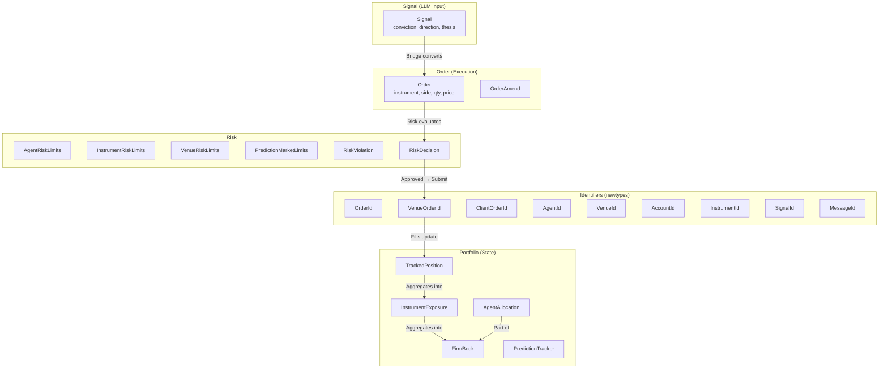
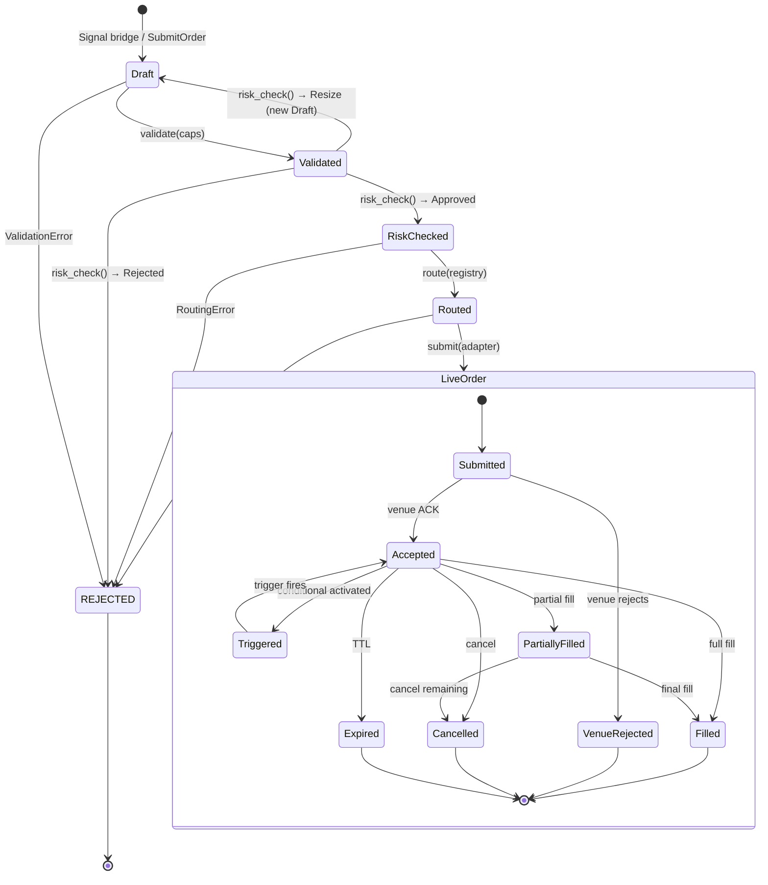
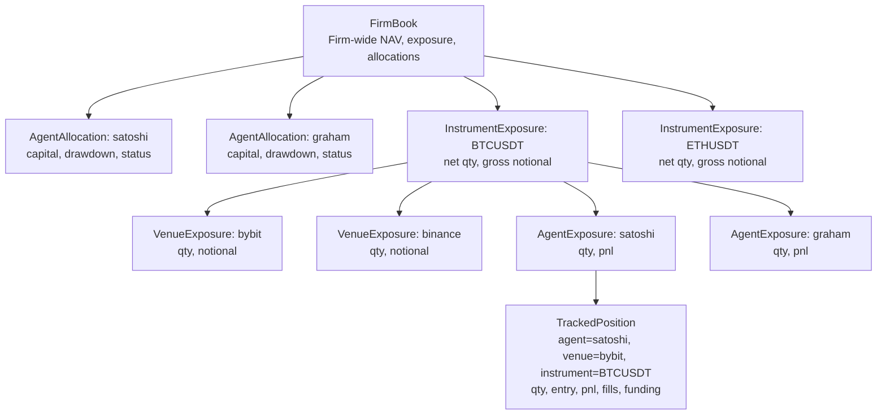
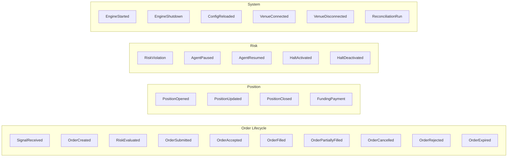

# Feynman Engine — Data Model

**Version:** 2.0.0
**Last Updated:** 2026-03-17

This document defines every type, state machine, and invariant in the engine. The source of truth for `crates/types/`.

---

## 1. Type Hierarchy Overview



---

## 2. Signal (LLM Agent Input)

The signal is the raw output from an LLM trader agent. It expresses intent and conviction but is not directly executable.

```rust
pub struct Signal {
    pub id: SignalId,
    pub agent: AgentId,
    pub instrument: InstrumentId,
    pub direction: Side,
    pub conviction: Decimal,          // 0.0–1.0, required
    pub sizing_hint: Option<Decimal>, // notional USD, optional
    pub arb_type: String,             // dispatch key: "funding_rate", "basis", "directional"
    pub stop_loss: Option<Decimal>,   // required for perps (enforced by risk gate)
    pub take_profit: Option<Decimal>,
    pub thesis: String,               // reasoning for audit trail
    pub urgency: Urgency,
    pub metadata: serde_json::Value,  // opaque context
    pub created_at: DateTime<Utc>,
}

pub enum Side { Buy, Sell }
pub enum Urgency { Low, Normal, High, Immediate }
```

### Signal Validation Rules

| Field | Validation | Failure |
|-------|-----------|---------|
| `conviction` | 0.0 ≤ x ≤ 1.0 | Reject signal |
| `stop_loss` | Required for perps; must be finite positive | Reject signal |
| `instrument` | Must exist in allowed instruments for agent | Reject signal |
| `arb_type` | Must match a registered plugin | Reject signal |
| `thesis` | Non-empty | Reject signal |

---

## 3. Order Model (Hybrid Type-State + Runtime FSM)

The order lifecycle has two fundamentally different phases:

| Phase | Nature | Who drives | Safety mechanism |
|-------|--------|-----------|-----------------|
| **Pipeline** (pre-submission) | Linear, deterministic, engine-controlled | Engine code | **Type-state** (compile-time) |
| **Venue** (post-submission) | Event-driven, branching, external events | Exchange | **Runtime FSM** (exhaustive match) |

A single FSM cannot serve both well. The pipeline needs compile-time guarantees (you cannot submit without risk approval). The venue lifecycle needs runtime flexibility (fills arrive as async events). The design uses **type-state for the pipeline** and a **runtime enum for the venue lifecycle**, connected by a consuming `submit()` that transforms one into the other.

### 3.1 Pipeline Order (Type-State — Compile-Time Safety)

```rust
// ── Zero-sized marker types (no runtime cost) ──

/// Order just created from signal/request. Not yet validated.
pub struct Draft;
/// Passed stateless validation (qty > 0, price valid, venue supports order type).
pub struct Validated;
/// Passed risk gate. Carries cryptographic-weight proof of approval.
pub struct RiskChecked;
/// Venue selected, adapter resolved, ready to submit.
pub struct Routed;

/// Sealed trait — only the four marker types above implement this.
/// External crates cannot add pipeline stages.
mod private { pub trait Sealed {} }
pub trait PipelineStage: private::Sealed {}

impl private::Sealed for Draft {}
impl private::Sealed for Validated {}
impl private::Sealed for RiskChecked {}
impl private::Sealed for Routed {}
impl PipelineStage for Draft {}
impl PipelineStage for Validated {}
impl PipelineStage for RiskChecked {}
impl PipelineStage for Routed {}
```

```rust
/// An order progressing through the pipeline. The type parameter `S`
/// determines which operations are available — invalid transitions
/// are compile errors, not runtime panics.
///
/// Fields are immutable after creation. Resizing creates a new
/// PipelineOrder<Draft> with adjusted qty/notional.
pub struct PipelineOrder<S: PipelineStage> {
    // ── Identity ──
    pub id: OrderId,
    pub client_order_id: ClientOrderId,  // idempotency key
    pub signal_id: Option<SignalId>,     // traceability (None for SubmitOrder)
    pub agent: AgentId,

    // ── Market ──
    pub instrument: InstrumentId,
    pub venue: VenueId,                  // selected by router (populated at Routed stage)
    pub market: MarketId,                // venue-native symbol

    // ── Intent ──
    pub side: Side,
    pub order_type: OrderType,
    pub qty: Decimal,                    // base currency units
    pub notional_usd: Decimal,           // qty * price (for risk checks)
    pub price: Option<Decimal>,          // None for market orders
    pub stop_loss: Option<Decimal>,      // required for SubmitSignal, optional for SubmitOrder
    pub take_profit: Option<Decimal>,

    // ── Constraints ──
    pub leverage: Option<Decimal>,
    pub time_in_force: TimeInForce,
    pub reduce_only: bool,
    pub post_only: bool,
    pub dry_run: bool,                   // default: true, always

    // ── Provenance ──
    pub conviction: Option<Decimal>,     // from signal (None for SubmitOrder)
    pub thesis: Option<String>,          // from signal (None for SubmitOrder)
    pub created_at: DateTime<Utc>,

    // ── Stage-specific proof (populated as order advances) ──
    pub(crate) _stage: PhantomData<S>,
}

pub enum OrderType {
    Market,
    Limit,
    StopMarket,
    StopLimit,
    TakeProfit,
    TrailingStop { callback_rate: Decimal },
}

pub enum TimeInForce {
    GoodTilCancelled,
    ImmediateOrCancel,
    FillOrKill,
    GoodTilTime(DateTime<Utc>),
    PostOnly,
}
```

### 3.2 Pipeline Transitions (Consuming Methods)

Each transition **consumes** the previous stage and returns the next. The old value is gone — you cannot use a `Draft` order after validating it.

```rust
impl PipelineOrder<Draft> {
    /// Stateless validation: qty > 0, price valid, venue supports order type,
    /// precision within venue limits. No I/O, no state access.
    #[must_use]
    pub fn validate(self, caps: &VenueCapabilities) -> Result<PipelineOrder<Validated>, ValidationError>;
}

impl PipelineOrder<Validated> {
    /// Risk evaluation: circuit breakers → L1 risk checks → per-agent isolation.
    /// Returns RiskChecked with proof of approval, or RejectedOrder on failure.
    /// Deterministic, no I/O. May resize (returns new Draft if resize needed).
    #[must_use]
    pub fn risk_check(
        self,
        risk_gate: &dyn RiskEvaluator,
        firm_book: &FirmBook,
        agent_limits: &AgentRiskLimits,
    ) -> RiskOutcome;
}

/// Risk check has three outcomes — not two.
pub enum RiskOutcome {
    /// Approved as-is. Carries proof.
    Approved(PipelineOrder<RiskChecked>, RiskProof),
    /// Approved but must be resized. Returns a new Draft with adjusted qty/notional.
    /// The caller must re-validate and re-risk-check the resized order.
    Resize {
        resized: PipelineOrder<Draft>,
        original_notional: Decimal,
        approved_notional: Decimal,
        reason: String,
    },
    /// Rejected. Terminal — this order is done.
    Rejected(RejectedOrder),
}

impl PipelineOrder<RiskChecked> {
    /// Select venue and resolve adapter. Populates venue/market fields.
    #[must_use]
    pub fn route(
        self,
        registry: &dyn AdapterRegistry,
        symbol_map: &SymbolMap,
    ) -> Result<PipelineOrder<Routed>, RoutingError>;
}

impl PipelineOrder<Routed> {
    /// Submit to venue. **Consumes the pipeline order** and returns a LiveOrder
    /// with runtime FSM for venue-driven state changes. This is the boundary
    /// between compile-time safety and runtime flexibility.
    ///
    /// Checks dry_run before submission. Idempotent on client_order_id.
    #[must_use]
    pub async fn submit(
        self,
        adapter: &dyn VenueAdapter,
    ) -> Result<LiveOrder, SubmissionError>;
}
```

### 3.3 Pipeline State Diagram



### 3.4 Proof Types

```rust
/// Proof that the risk gate approved this order. Carried from RiskChecked
/// through Routed and into LiveOrder for audit trail.
pub struct RiskProof {
    pub approved_at: DateTime<Utc>,
    pub checks_performed: Vec<RiskCheckResult>,
    pub warnings: Vec<RiskViolation>,  // non-blocking (soft) warnings
}

/// Result of a single risk check.
pub struct RiskCheckResult {
    pub check_name: String,
    pub passed: bool,
    pub current_value: Decimal,
    pub limit_value: Decimal,
}
```

### 3.5 Rejected Order

Orders can be rejected at any pipeline stage (validation, risk, routing, submission). All rejections produce a `RejectedOrder` for journaling and audit.

```rust
/// Terminal state for orders rejected before reaching a venue.
/// Journaled as EventKind::OrderRejected.
pub struct RejectedOrder {
    pub id: OrderId,
    pub agent: AgentId,
    pub instrument: InstrumentId,
    pub reason: RejectionReason,
    pub at: DateTime<Utc>,
}

pub enum RejectionReason {
    /// Failed stateless validation (qty, price, unsupported order type).
    ValidationFailed(Vec<ValidationError>),
    /// Circuit breaker tripped (L0).
    CircuitBreakerTripped { breaker: String, reason: String },
    /// Risk gate rejected (L1).
    RiskGateRejected { violations: Vec<RiskViolation> },
    /// No suitable venue/adapter found.
    RoutingFailed { reason: String },
    /// Venue rejected on submission (before entering venue lifecycle).
    SubmissionFailed { reason: String },
}
```

### 3.6 Live Order (Runtime FSM — Venue Lifecycle)

Once submitted to a venue, the order enters a runtime FSM driven by external events (fills, cancels, expirations). Type-state is not appropriate here because transitions are data-driven and non-deterministic.

```rust
/// An order that has been submitted to a venue and is now in the
/// venue-driven lifecycle. State changes come from venue events
/// (fills, cancels, expirations), not engine pipeline stages.
///
/// Owned by the Sequencer. State mutations happen only inside
/// Sequencer command processing.
pub struct LiveOrder {
    // ── Identity (immutable, carried from PipelineOrder) ──
    pub id: OrderId,
    pub client_order_id: ClientOrderId,
    pub venue_order_id: VenueOrderId,
    pub signal_id: Option<SignalId>,
    pub agent: AgentId,

    // ── Market (immutable) ──
    pub instrument: InstrumentId,
    pub venue: VenueId,
    pub market: MarketId,
    pub side: Side,
    pub order_type: OrderType,
    pub original_qty: Decimal,
    pub price: Option<Decimal>,

    // ── Mutable state ──
    pub state: VenueState,
    pub fills: Vec<Fill>,

    // ── Provenance ──
    pub risk_proof: RiskProof,
    pub created_at: DateTime<Utc>,
    pub submitted_at: DateTime<Utc>,
}
```

### 3.7 Venue State Machine (Runtime Enum)

```rust
pub enum VenueState {
    /// Sent to venue, awaiting acknowledgment.
    Submitted,

    /// Venue acknowledged, order resting on book (limit orders).
    Accepted { accepted_at: DateTime<Utc> },

    /// Conditional order (stop/TP/trailing) accepted, waiting for trigger.
    Triggered { triggered_at: DateTime<Utc> },

    /// Some quantity executed.
    PartiallyFilled { summary: FillSummary },

    /// Fully filled. Terminal.
    Filled { summary: FillSummary, filled_at: DateTime<Utc> },

    /// Rejected by venue. Terminal.
    VenueRejected { reason: String, rejected_at: DateTime<Utc> },

    /// Cancelled (may have partial fills). Terminal.
    Cancelled { reason: CancelReason, summary: FillSummary, cancelled_at: DateTime<Utc> },

    /// Expired (GTD/Day TIF). Terminal.
    Expired { summary: FillSummary, expired_at: DateTime<Utc> },
}

/// Aggregated fill state for an order.
pub struct FillSummary {
    pub filled_qty: Decimal,
    pub remaining_qty: Decimal,
    pub avg_fill_price: Decimal,
    pub total_fee: Decimal,
    pub fill_count: u32,
}

impl FillSummary {
    pub fn empty(original_qty: Decimal) -> Self {
        Self {
            filled_qty: Decimal::ZERO,
            remaining_qty: original_qty,
            avg_fill_price: Decimal::ZERO,
            total_fee: Decimal::ZERO,
            fill_count: 0,
        }
    }
}

pub enum CancelReason {
    UserRequested,
    AgentRequested { agent: AgentId },
    RiskGateKilled,
    CircuitBreakerTripped,
    LinkedOrderFilled,       // OCO counterpart filled
    Timeout,
    InsufficientBalance,
    VenueCancelled { venue_reason: String },
    SelfTradePreventionTriggered,
}
```

### 3.8 Venue State Transitions (Validated at Runtime)

Transitions are methods on `VenueState` that return `Result`. Invalid transitions return `Err(InvalidTransition)` — never panic. **No wildcard `_` match** on `VenueState` variants (exhaustive match enforced by CLAUDE.md rules).

```rust
/// Error for invalid state transitions. Contains forensic context.
pub struct InvalidTransition {
    pub order_id: OrderId,
    pub from: String,        // current state name
    pub attempted: String,   // attempted transition
    pub at: DateTime<Utc>,
}

impl VenueState {
    pub fn on_accepted(self, at: DateTime<Utc>) -> Result<Self, InvalidTransition> {
        match self {
            Self::Submitted => Ok(Self::Accepted { accepted_at: at }),
            Self::Triggered { .. } => Ok(Self::Accepted { accepted_at: at }),
            // All other states explicitly listed — no wildcard
            Self::Accepted { .. }
            | Self::PartiallyFilled { .. }
            | Self::Filled { .. }
            | Self::VenueRejected { .. }
            | Self::Cancelled { .. }
            | Self::Expired { .. } => Err(InvalidTransition { .. }),
        }
    }

    pub fn on_fill(self, fill: &Fill, original_qty: Decimal) -> Result<Self, InvalidTransition> {
        match self {
            Self::Accepted { .. } | Self::PartiallyFilled { .. } => {
                let mut summary = match &self {
                    Self::PartiallyFilled { summary } => summary.clone(),
                    _ => FillSummary::empty(original_qty),
                };
                // Update summary with new fill...
                if summary.remaining_qty == Decimal::ZERO {
                    Ok(Self::Filled { summary, filled_at: fill.timestamp })
                } else {
                    Ok(Self::PartiallyFilled { summary })
                }
            }
            // Explicit rejection of all other states
            Self::Submitted
            | Self::Triggered { .. }
            | Self::Filled { .. }
            | Self::VenueRejected { .. }
            | Self::Cancelled { .. }
            | Self::Expired { .. } => Err(InvalidTransition { .. }),
        }
    }

    pub fn on_cancel(self, reason: CancelReason, at: DateTime<Utc>) -> Result<Self, InvalidTransition>;
    pub fn on_reject(self, reason: String, at: DateTime<Utc>) -> Result<Self, InvalidTransition>;
    pub fn on_expire(self, at: DateTime<Utc>) -> Result<Self, InvalidTransition>;
    pub fn on_triggered(self, at: DateTime<Utc>) -> Result<Self, InvalidTransition>;

    /// Is this order in a terminal state?
    pub fn is_terminal(&self) -> bool {
        matches!(self,
            Self::Filled { .. }
            | Self::VenueRejected { .. }
            | Self::Cancelled { .. }
            | Self::Expired { .. }
        )
    }

    /// Is this order live on the venue (can receive fills)?
    pub fn is_live(&self) -> bool {
        matches!(self,
            Self::Accepted { .. }
            | Self::PartiallyFilled { .. }
        )
    }
}
```

### 3.9 Valid Venue State Transitions

```
Submitted ──► Accepted ──► PartiallyFilled ──► Filled
    │             │              │
    │             │              └──► Cancelled (partial fills preserved)
    │             │              └──► Expired (partial fills preserved)
    │             └──► Filled (single fill covers full qty)
    │             └──► Cancelled
    │             └──► Expired
    └──► Triggered ──► Accepted ──► ...
    └──► VenueRejected
```

| From | To | Trigger | Notes |
|------|----|---------|-------|
| Submitted | Accepted | Venue ACK | Order resting on book |
| Submitted | Triggered | Venue ACK (conditional) | Stop/TP waiting for trigger |
| Submitted | VenueRejected | Venue rejects | Terminal |
| Triggered | Accepted | Trigger condition met | Now active on book |
| Accepted | PartiallyFilled | Partial fill event | FillSummary updated |
| Accepted | Filled | Full fill event | Terminal |
| Accepted | Cancelled | Cancel request | Terminal |
| Accepted | Expired | TIF expired | Terminal |
| PartiallyFilled | Filled | Final fill | Terminal |
| PartiallyFilled | Cancelled | Cancel remaining | Partial fills preserved |

### 3.10 Design Invariants

| # | Invariant | Enforcement |
|---|-----------|------------|
| 1 | Cannot submit without risk approval | `submit()` only exists on `PipelineOrder<Routed>`, which requires passing through `RiskChecked` |
| 2 | Cannot skip validation | `risk_check()` only exists on `PipelineOrder<Validated>` |
| 3 | No state mutation before fill | `LiveOrder.state` only mutated by `on_fill()` inside Sequencer |
| 4 | Idempotent submission | `client_order_id` checked before creating `LiveOrder` |
| 5 | Terminal states are absorbing | `on_fill()` returns `Err` on terminal states |
| 6 | Partial fills preserved on cancel | `Cancelled` variant carries `FillSummary` |
| 7 | Risk proof carried to audit | `LiveOrder.risk_proof` is immutable after creation |
| 8 | Pipeline order consumed on submit | `submit()` takes `self` by value — old type is gone |
| 9 | No wildcard match on VenueState | Every variant explicitly handled in every transition method |
| 10 | Sequencer owns LiveOrder | No `Arc<Mutex<LiveOrder>>` — Sequencer owns `HashMap<OrderId, LiveOrder>` |

---

## 4. Portfolio State

### 4.1 FirmBook (Firm-Wide View)

```rust
pub struct FirmBook {
    pub total_nav: Decimal,             // total account value
    pub free_capital: Decimal,          // available for new orders
    pub total_unrealized_pnl: Decimal,
    pub total_realized_pnl: Decimal,
    pub total_fees_paid: Decimal,
    pub instruments: Vec<InstrumentExposure>,
    pub agent_allocations: Vec<AgentAllocation>,
    pub prediction_exposure: PredictionExposureSummary,
    pub nav_peak: Decimal,              // high-water mark for drawdown
    pub nav_peak_source: NavPeakSource, // bootstrap vs live
    pub as_of: DateTime<Utc>,
}

/// Source of NAV peak to prevent fabricated drawdown breaches.
/// See trading bot Issue #98.
pub enum NavPeakSource {
    Bootstrap,    // set from INITIAL_CAPITAL config at startup
    Live,         // updated from actual NAV during operation
    Reconciled,   // reset from exchange after detecting stale bootstrap
}
```

### Invariants

```
total_nav = free_capital + Σ(position_notional) + total_unrealized_pnl
Σ(agent_allocations.allocated_capital) ≤ total_nav
∀ agent: allocated_capital = used_capital + free_capital
nav_peak ≥ total_nav (by definition — it's the high-water mark)
```

### 4.2 AgentAllocation (Per-Agent View)

```rust
pub struct AgentAllocation {
    pub agent: AgentId,
    pub allocated_capital: Decimal,
    pub used_capital: Decimal,         // notional in open positions
    pub free_capital: Decimal,         // available for new orders
    pub realized_pnl: Decimal,
    pub unrealized_pnl: Decimal,
    pub current_drawdown: Decimal,     // pct from agent's peak
    pub max_drawdown_limit: Decimal,   // from AgentRiskLimits
    pub daily_pnl: Decimal,            // reset at 00:00 UTC
    pub open_order_count: u32,
    pub status: AgentStatus,
}

pub enum AgentStatus {
    Active,
    Paused { reason: String, since: DateTime<Utc> },
    DrawdownBreached,
    DailyLossBreached,
    Halted,  // firm-wide halt
}
```

### 4.3 Position Hierarchy



### 4.4 TrackedPosition

The leaf of the position hierarchy. One per (agent, venue, instrument) tuple.

```rust
pub struct TrackedPosition {
    pub agent: AgentId,
    pub venue: VenueId,
    pub account: AccountId,
    pub instrument: InstrumentId,
    pub side: Side,                     // net direction
    pub qty: Decimal,                   // absolute quantity
    pub avg_entry_price: Decimal,
    pub mark_price: Decimal,            // last known mark
    pub unrealized_pnl: Decimal,
    pub realized_pnl: Decimal,
    pub total_fees_paid: Decimal,
    pub accumulated_funding: Decimal,   // for perps
    pub fill_ids: Vec<(OrderId, u64)>,  // (order, fill_seq) for attribution
    pub signal_ids: Vec<SignalId>,       // which signals led here
    pub leverage: Option<Decimal>,
    pub liquidation_price: Option<Decimal>,
    pub opened_at: DateTime<Utc>,
    pub last_fill_at: DateTime<Utc>,
}
```

---

## 5. Risk Types

### 5.1 AgentRiskLimits

```rust
pub struct AgentRiskLimits {
    pub agent: AgentId,
    pub allocated_capital: Decimal,
    pub max_position_notional: Decimal,  // single position cap
    pub max_gross_notional: Decimal,     // total exposure cap
    pub max_drawdown_pct: Decimal,       // e.g., 3.0 = 3%
    pub max_daily_loss: Decimal,         // absolute USD
    pub max_open_orders: u32,
    pub max_leverage: Decimal,           // e.g., 3.0x
    pub allowed_instruments: Vec<InstrumentId>,
    pub allowed_venues: Vec<VenueId>,
}
```

### 5.2 Firm-Level Risk Limits

```rust
pub struct FirmRiskLimits {
    pub max_gross_notional: Decimal,
    pub max_net_notional: Decimal,
    pub max_drawdown_pct: Decimal,
    pub max_daily_loss: Decimal,
    pub max_open_orders: u32,
    pub cash_reserve_pct: Decimal,       // minimum cash as % of NAV
    pub min_risk_reward_ratio: Decimal,  // minimum R:R for approval
}
```

### 5.3 RiskViolation

```rust
pub struct RiskViolation {
    pub check_name: String,            // e.g., "stop_loss_required"
    pub layer: RiskLayer,
    pub violation_type: ViolationType,
    pub current_value: Decimal,
    pub limit_value: Decimal,
    pub message: String,
    pub suggested_action: SuggestedAction,
}

pub enum RiskLayer { L0, L1, L2, L3 }

pub enum ViolationType {
    Hard,    // order must be rejected
    Soft,    // warning, order can proceed
    Resize,  // order can proceed if resized
}

pub enum SuggestedAction {
    Reject,
    Resize { max_notional: Decimal },
    Warn,
    PauseAgent,
    HaltAll,
}
```

### 5.4 Risk Check Decision Matrix

**Universal checks (all order paths):**

| Check | Hard/Soft | On Fail | Resizable? |
|-------|-----------|---------|-----------|
| 1. Position ≤ 5% NAV | Resize | Resize to 5% | Yes |
| 2. Account risk ≤ 1% NAV | Resize | Resize position | Yes |
| 3. Leverage within limits | Hard | Reject | No |
| 4. Drawdown within threshold | Hard | Reject ALL orders for agent | No |
| 5. Cash ≥ 20% NAV | Hard | Reject | No |

**Signal-specific checks (`SubmitSignal` only):**

| Check | Hard/Soft | On Fail | Resizable? |
|-------|-----------|---------|-----------|
| 6. Stop loss defined | Hard | Reject signal | No |
| 7. R:R ≥ 2:1 | Hard | Reject signal | No |

Note: For account risk (check 2), if `stop_loss` is absent, `max_loss = notional` (worst case).

---

## 6. Event Types

Events that flow through the journal and bus:



---

## 7. Reconciliation Model

The engine periodically reconciles local state against venue state to detect drift.

```rust
pub struct ReconciliationResult {
    pub venue: VenueId,
    pub timestamp: DateTime<Utc>,
    pub phantom_positions: Vec<TrackedPosition>,    // local has, venue doesn't
    pub untracked_positions: Vec<VenuePosition>,    // venue has, local doesn't
    pub qty_mismatches: Vec<QtyMismatch>,           // both have, qty differs
    pub balance_drift: Option<BalanceDrift>,
}

pub struct QtyMismatch {
    pub instrument: InstrumentId,
    pub local_qty: Decimal,
    pub venue_qty: Decimal,
    pub delta: Decimal,
}

pub struct BalanceDrift {
    pub local_balance: Decimal,
    pub venue_balance: Decimal,
    pub drift_pct: Decimal,
}
```

### Reconciliation Triggers

| Trigger | Frequency | Action on Mismatch |
|---------|-----------|-------------------|
| Periodic | Every 60s | Log warning, publish `risk.alerts` |
| On startup | Once | Block trading until resolved if drift > 1% |
| After fill | Per fill | Verify fill qty matches venue report |
| Manual | On demand via gRPC | Full reconciliation report |

---

## 8. Identifier Design

All identifiers are newtype wrappers for compile-time safety.

```rust
// Prevent accidentally passing an AgentId where a VenueId is expected.
pub struct OrderId(pub String);
pub struct VenueOrderId(pub String);
pub struct ClientOrderId(pub String);  // NEW: for idempotent submission
pub struct AgentId(pub String);
pub struct VenueId(pub String);
pub struct AccountId(pub String);
pub struct InstrumentId(pub String);
pub struct SignalId(pub String);
pub struct MessageId(pub String);
```

### ID Generation

| ID Type | Format | Generator |
|---------|--------|-----------|
| OrderId | `ord_{ulid}` | Engine (on Signal receipt) |
| ClientOrderId | `{agent}_{signal_id}_{timestamp}` | Bridge (idempotency key) |
| SignalId | `sig_{ulid}` | Agent (via MCP) |
| MessageId | Redis Stream ID | Redis (`XADD *`) |

---

## 9. Configuration Types

```rust
pub struct EngineConfig {
    pub engine: EngineSettings,
    pub redis: RedisConfig,
    pub risk: RiskConfig,
    pub venues: HashMap<VenueId, VenueConfig>,
    pub shutdown: ShutdownConfig,
}

pub struct EngineSettings {
    pub execution_mode: ExecutionMode,
    pub dry_run: bool,
    pub grpc_port: u16,
    pub dashboard_port: u16,
    pub log_level: String,
}

pub struct RiskConfig {
    pub firm: FirmRiskLimits,
    pub agents: HashMap<AgentId, AgentRiskLimits>,
    pub instruments: HashMap<InstrumentId, InstrumentRiskLimits>,
    pub venues: HashMap<VenueId, VenueRiskLimits>,
    pub prediction: Option<PredictionMarketLimits>,
}

pub struct ShutdownConfig {
    pub drain_timeout_secs: u64,
    pub cancel_pending_on_shutdown: bool,
    pub snapshot_on_shutdown: bool,
}
```
