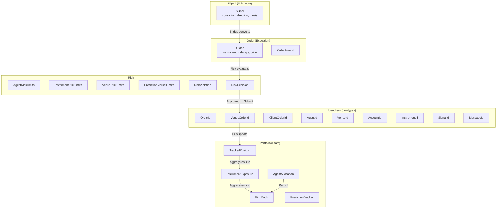
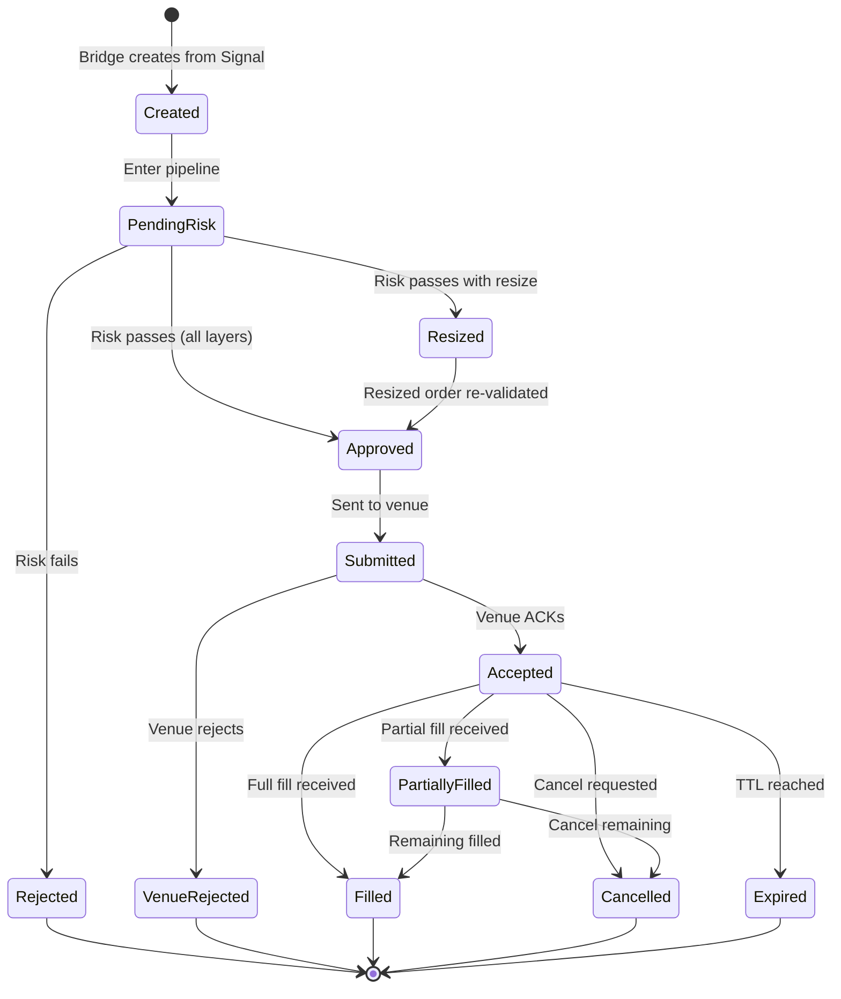
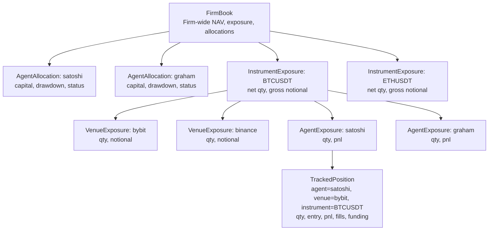
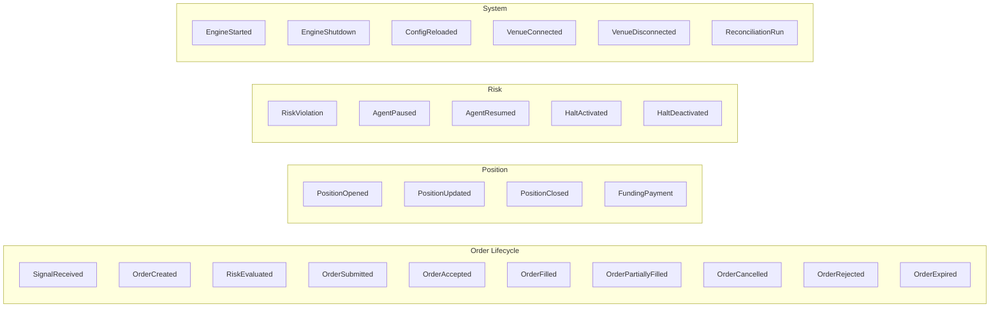

# Feynman Engine — Data Model

**Version:** 2.0.0
**Last Updated:** 2026-03-17

This document defines every type, state machine, and invariant in the engine. The source of truth for `crates/types/`.

---

## 1. Type Hierarchy Overview



---

## 2. Signal (LLM Agent Input)

The signal is the raw output from an LLM trader agent. It expresses intent and conviction but is not directly executable.

```rust
pub struct Signal {
    pub id: SignalId,
    pub agent: AgentId,
    pub instrument: InstrumentId,
    pub direction: Side,
    pub conviction: Decimal,          // 0.0–1.0, required
    pub sizing_hint: Option<Decimal>, // notional USD, optional
    pub arb_type: String,             // dispatch key: "funding_rate", "basis", "directional"
    pub stop_loss: Option<Decimal>,   // required for perps (enforced by risk gate)
    pub take_profit: Option<Decimal>,
    pub thesis: String,               // reasoning for audit trail
    pub urgency: Urgency,
    pub metadata: serde_json::Value,  // opaque context
    pub created_at: DateTime<Utc>,
}

pub enum Side { Buy, Sell }
pub enum Urgency { Low, Normal, High, Immediate }
```

### Signal Validation Rules

| Field | Validation | Failure |
|-------|-----------|---------|
| `conviction` | 0.0 ≤ x ≤ 1.0 | Reject signal |
| `stop_loss` | Required for perps; must be finite positive | Reject signal |
| `instrument` | Must exist in allowed instruments for agent | Reject signal |
| `arb_type` | Must match a registered plugin | Reject signal |
| `thesis` | Non-empty | Reject signal |

---

## 3. Order (Execution Model)

**This is the missing type.** The bridge converts a Signal into an Order, which is what the pipeline and venue adapters work with.

```rust
/// An order ready for risk evaluation and venue submission.
/// Created by the bridge from a Signal. Immutable once created
/// (amendments create new orders).
pub struct Order {
    pub id: OrderId,
    pub client_order_id: ClientOrderId,
    pub signal_id: SignalId,         // traceability back to signal
    pub agent: AgentId,
    pub instrument: InstrumentId,
    pub venue: VenueId,             // selected by router
    pub side: Side,
    pub order_type: OrderType,
    pub qty: Decimal,                // in base currency units
    pub notional_usd: Decimal,       // qty * price (for risk checks)
    pub price: Option<Decimal>,      // None for market orders
    pub stop_loss: Decimal,          // always present (enforced by bridge)
    pub take_profit: Option<Decimal>,
    pub leverage: Option<Decimal>,   // for perps
    pub time_in_force: TimeInForce,
    pub reduce_only: bool,
    pub post_only: bool,
    pub conviction: Decimal,         // carried from signal for attribution
    pub thesis: String,              // carried from signal for audit
    pub created_at: DateTime<Utc>,
    pub state: OrderState,
}

pub enum OrderType {
    Market,
    Limit,
    StopMarket,
    StopLimit,
    TakeProfit,
    TrailingStop { callback_rate: Decimal },
}

pub enum TimeInForce {
    GoodTilCancelled,
    ImmediateOrCancel,
    FillOrKill,
    GoodTilTime(DateTime<Utc>),
    PostOnly,
}
```

### Order State Machine



```rust
pub enum OrderState {
    /// Order created by bridge, not yet evaluated.
    Created,
    /// In the risk evaluation pipeline.
    PendingRisk,
    /// Approved by all risk layers.
    Approved,
    /// Approved but resized to fit limits.
    Resized { original_notional: Decimal },
    /// Sent to venue, awaiting ACK.
    Submitted,
    /// Venue accepted the order.
    Accepted { venue_order_id: VenueOrderId },
    /// Partially filled (some qty executed).
    PartiallyFilled {
        venue_order_id: VenueOrderId,
        filled_qty: Decimal,
        remaining_qty: Decimal,
        avg_fill_price: Decimal,
    },
    /// Fully filled.
    Filled {
        venue_order_id: VenueOrderId,
        filled_qty: Decimal,
        avg_fill_price: Decimal,
    },
    /// Rejected by risk gate.
    Rejected { violations: Vec<RiskViolation> },
    /// Rejected by venue.
    VenueRejected { reason: String },
    /// Cancelled (by agent or system).
    Cancelled { reason: String },
    /// Expired (TTL reached).
    Expired,
}

impl OrderState {
    /// Is this order in a terminal state?
    pub fn is_terminal(&self) -> bool {
        matches!(self,
            OrderState::Filled { .. }
            | OrderState::Rejected { .. }
            | OrderState::VenueRejected { .. }
            | OrderState::Cancelled { .. }
            | OrderState::Expired
        )
    }

    /// Is this order live on the venue?
    pub fn is_live(&self) -> bool {
        matches!(self,
            OrderState::Accepted { .. }
            | OrderState::PartiallyFilled { .. }
        )
    }
}
```

### Valid State Transitions

| From | To | Trigger |
|------|----|---------|
| Created | PendingRisk | Pipeline.process() |
| PendingRisk | Approved | All risk checks pass |
| PendingRisk | Resized | Risk passes with resize |
| PendingRisk | Rejected | Any risk check fails (hard) |
| Approved | Submitted | VenueAdapter.submit_order() |
| Resized | Approved | Resized order re-approved |
| Submitted | Accepted | Venue ACK received |
| Submitted | VenueRejected | Venue rejects |
| Accepted | PartiallyFilled | Partial fill event |
| Accepted | Filled | Full fill event |
| Accepted | Cancelled | Cancel request |
| PartiallyFilled | Filled | Final fill |
| PartiallyFilled | Cancelled | Cancel remaining |

---

## 4. Portfolio State

### 4.1 FirmBook (Firm-Wide View)

```rust
pub struct FirmBook {
    pub total_nav: Decimal,             // total account value
    pub free_capital: Decimal,          // available for new orders
    pub total_unrealized_pnl: Decimal,
    pub total_realized_pnl: Decimal,
    pub total_fees_paid: Decimal,
    pub instruments: Vec<InstrumentExposure>,
    pub agent_allocations: Vec<AgentAllocation>,
    pub prediction_exposure: PredictionExposureSummary,
    pub nav_peak: Decimal,              // high-water mark for drawdown
    pub nav_peak_source: NavPeakSource, // bootstrap vs live
    pub as_of: DateTime<Utc>,
}

/// Source of NAV peak to prevent fabricated drawdown breaches.
/// See trading bot Issue #98.
pub enum NavPeakSource {
    Bootstrap,    // set from INITIAL_CAPITAL config at startup
    Live,         // updated from actual NAV during operation
    Reconciled,   // reset from exchange after detecting stale bootstrap
}
```

### Invariants

```
total_nav = free_capital + Σ(position_notional) + total_unrealized_pnl
Σ(agent_allocations.allocated_capital) ≤ total_nav
∀ agent: allocated_capital = used_capital + free_capital
nav_peak ≥ total_nav (by definition — it's the high-water mark)
```

### 4.2 AgentAllocation (Per-Agent View)

```rust
pub struct AgentAllocation {
    pub agent: AgentId,
    pub allocated_capital: Decimal,
    pub used_capital: Decimal,         // notional in open positions
    pub free_capital: Decimal,         // available for new orders
    pub realized_pnl: Decimal,
    pub unrealized_pnl: Decimal,
    pub current_drawdown: Decimal,     // pct from agent's peak
    pub max_drawdown_limit: Decimal,   // from AgentRiskLimits
    pub daily_pnl: Decimal,            // reset at 00:00 UTC
    pub open_order_count: u32,
    pub status: AgentStatus,
}

pub enum AgentStatus {
    Active,
    Paused { reason: String, since: DateTime<Utc> },
    DrawdownBreached,
    DailyLossBreached,
    Halted,  // firm-wide halt
}
```

### 4.3 Position Hierarchy



### 4.4 TrackedPosition

The leaf of the position hierarchy. One per (agent, venue, instrument) tuple.

```rust
pub struct TrackedPosition {
    pub agent: AgentId,
    pub venue: VenueId,
    pub account: AccountId,
    pub instrument: InstrumentId,
    pub side: Side,                     // net direction
    pub qty: Decimal,                   // absolute quantity
    pub avg_entry_price: Decimal,
    pub mark_price: Decimal,            // last known mark
    pub unrealized_pnl: Decimal,
    pub realized_pnl: Decimal,
    pub total_fees_paid: Decimal,
    pub accumulated_funding: Decimal,   // for perps
    pub fill_ids: Vec<(OrderId, u64)>,  // (order, fill_seq) for attribution
    pub signal_ids: Vec<SignalId>,       // which signals led here
    pub leverage: Option<Decimal>,
    pub liquidation_price: Option<Decimal>,
    pub opened_at: DateTime<Utc>,
    pub last_fill_at: DateTime<Utc>,
}
```

---

## 5. Risk Types

### 5.1 AgentRiskLimits

```rust
pub struct AgentRiskLimits {
    pub agent: AgentId,
    pub allocated_capital: Decimal,
    pub max_position_notional: Decimal,  // single position cap
    pub max_gross_notional: Decimal,     // total exposure cap
    pub max_drawdown_pct: Decimal,       // e.g., 3.0 = 3%
    pub max_daily_loss: Decimal,         // absolute USD
    pub max_open_orders: u32,
    pub max_leverage: Decimal,           // e.g., 3.0x
    pub allowed_instruments: Vec<InstrumentId>,
    pub allowed_venues: Vec<VenueId>,
}
```

### 5.2 Firm-Level Risk Limits

```rust
pub struct FirmRiskLimits {
    pub max_gross_notional: Decimal,
    pub max_net_notional: Decimal,
    pub max_drawdown_pct: Decimal,
    pub max_daily_loss: Decimal,
    pub max_open_orders: u32,
    pub cash_reserve_pct: Decimal,       // minimum cash as % of NAV
    pub min_risk_reward_ratio: Decimal,  // minimum R:R for approval
}
```

### 5.3 RiskViolation

```rust
pub struct RiskViolation {
    pub check_name: String,            // e.g., "stop_loss_required"
    pub layer: RiskLayer,
    pub violation_type: ViolationType,
    pub current_value: Decimal,
    pub limit_value: Decimal,
    pub message: String,
    pub suggested_action: SuggestedAction,
}

pub enum RiskLayer { L0, L1, L2, L3 }

pub enum ViolationType {
    Hard,    // order must be rejected
    Soft,    // warning, order can proceed
    Resize,  // order can proceed if resized
}

pub enum SuggestedAction {
    Reject,
    Resize { max_notional: Decimal },
    Warn,
    PauseAgent,
    HaltAll,
}
```

### 5.4 MVP Risk Check Decision Matrix

| Check | Hard/Soft | On Fail | Resizable? |
|-------|-----------|---------|-----------|
| 1. Stop loss defined | Hard | Reject | No |
| 2. R:R ≥ 2:1 | Hard | Reject | No |
| 3. Position ≤ 5% NAV | Resize | Resize to 5% | Yes |
| 4. Account risk ≤ 1% NAV | Resize | Resize position | Yes |
| 5. Leverage within limits | Hard | Reject | No |
| 6. Drawdown < 15% | Hard | Reject ALL orders for agent | No |
| 7. Cash ≥ 20% NAV | Hard | Reject | No |

---

## 6. Event Types

Events that flow through the journal and bus:



---

## 7. Reconciliation Model

The engine periodically reconciles local state against venue state to detect drift.

```rust
pub struct ReconciliationResult {
    pub venue: VenueId,
    pub timestamp: DateTime<Utc>,
    pub phantom_positions: Vec<TrackedPosition>,    // local has, venue doesn't
    pub untracked_positions: Vec<VenuePosition>,    // venue has, local doesn't
    pub qty_mismatches: Vec<QtyMismatch>,           // both have, qty differs
    pub balance_drift: Option<BalanceDrift>,
}

pub struct QtyMismatch {
    pub instrument: InstrumentId,
    pub local_qty: Decimal,
    pub venue_qty: Decimal,
    pub delta: Decimal,
}

pub struct BalanceDrift {
    pub local_balance: Decimal,
    pub venue_balance: Decimal,
    pub drift_pct: Decimal,
}
```

### Reconciliation Triggers

| Trigger | Frequency | Action on Mismatch |
|---------|-----------|-------------------|
| Periodic | Every 60s | Log warning, publish `risk.alerts` |
| On startup | Once | Block trading until resolved if drift > 1% |
| After fill | Per fill | Verify fill qty matches venue report |
| Manual | On demand via gRPC | Full reconciliation report |

---

## 8. Identifier Design

All identifiers are newtype wrappers for compile-time safety.

```rust
// Prevent accidentally passing an AgentId where a VenueId is expected.
pub struct OrderId(pub String);
pub struct VenueOrderId(pub String);
pub struct ClientOrderId(pub String);  // NEW: for idempotent submission
pub struct AgentId(pub String);
pub struct VenueId(pub String);
pub struct AccountId(pub String);
pub struct InstrumentId(pub String);
pub struct SignalId(pub String);
pub struct MessageId(pub String);
```

### ID Generation

| ID Type | Format | Generator |
|---------|--------|-----------|
| OrderId | `ord_{ulid}` | Engine (on Signal receipt) |
| ClientOrderId | `{agent}_{signal_id}_{timestamp}` | Bridge (idempotency key) |
| SignalId | `sig_{ulid}` | Agent (via MCP) |
| MessageId | Redis Stream ID | Redis (`XADD *`) |

---

## 9. Configuration Types

```rust
pub struct EngineConfig {
    pub engine: EngineSettings,
    pub redis: RedisConfig,
    pub risk: RiskConfig,
    pub venues: HashMap<VenueId, VenueConfig>,
    pub shutdown: ShutdownConfig,
}

pub struct EngineSettings {
    pub execution_mode: ExecutionMode,
    pub dry_run: bool,
    pub grpc_port: u16,
    pub dashboard_port: u16,
    pub log_level: String,
}

pub struct RiskConfig {
    pub firm: FirmRiskLimits,
    pub agents: HashMap<AgentId, AgentRiskLimits>,
    pub instruments: HashMap<InstrumentId, InstrumentRiskLimits>,
    pub venues: HashMap<VenueId, VenueRiskLimits>,
    pub prediction: Option<PredictionMarketLimits>,
}

pub struct ShutdownConfig {
    pub drain_timeout_secs: u64,
    pub cancel_pending_on_shutdown: bool,
    pub snapshot_on_shutdown: bool,
}
```
