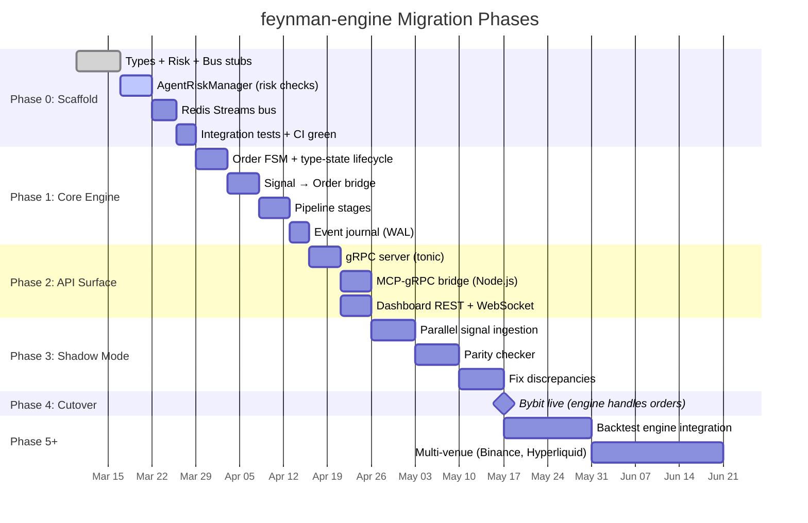
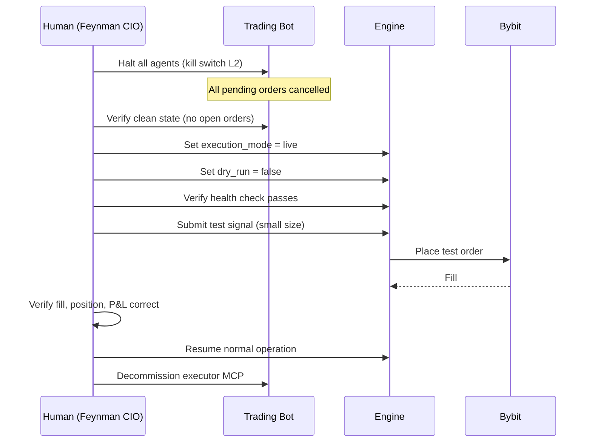

# Feynman Engine — Migration Plan

**Version:** 2.0.0
**Last Updated:** 2026-03-17

Phased migration from feynman_trading_bot (Node.js MCP) to feynman-engine (Rust). The trading bot continues operating throughout — this is a parallel build, not a rewrite-in-place.

---

## Guiding Principle

**Never risk the live trading system.** The engine is built and validated in parallel. Cutover happens only after shadow mode proves parity. The trading bot can always be rolled back to.

---

## Phase Overview



---

## Phase 0: Scaffold (Current)

**Duration:** 2 weeks
**Risk:** Low
**Gate Alignment:** Pre-Gate 1 (trading bot earning track record)

### Deliverables

| # | Task | Crate | Status | Exit Criteria |
|---|------|-------|--------|--------------|
| 0.1 | Domain types | `types` | ✅ Done | `cargo build -p types` passes, serde round-trip tests |
| 0.2 | AgentRiskManager | `risk` | 🚧 In Progress | All risk checks implemented (universal + signal-specific), property tests pass |
| 0.3 | Redis Streams client | `bus` | ⏳ Pending | Publish → subscribe → ack round-trip, consumer group redelivery |
| 0.4 | Integration tests | `tests/` | ⏳ Pending | 7 risk tests + 3 bus tests pass |
| 0.5 | Docker smoke test | `docker/` | ⏳ Pending | `docker compose up` starts engine + Redis, health check passes |
| 0.6 | CI green | `.github/` | ⏳ Pending | `cargo test` + `clippy` + `fmt` all pass |

### Key Decision: Order Type

The `Order` type must be defined in Phase 0 even though the bridge isn't built yet. `AgentRiskManager::evaluate()` needs an `Order` (not a `Signal`) because:
- Risk checks need `qty`, `notional_usd`, `stop_loss`, `leverage` — these are computed values, not raw signal fields
- The signal's `sizing_hint` is an LLM suggestion; the order's `qty` is the computed position size

See DATA_MODEL.md §3 for the Order type definition.

---

## Phase 1: Core Engine

**Duration:** 3 weeks
**Risk:** Medium
**Gate Alignment:** Gate 1 (50 closed trades in trading bot)

> **Decision (2026-03-17):** NautilusTrader Rust crates were evaluated and rejected.
> The engine is fully custom Rust with per-exchange client crates for venue connectivity.
> See `HYBRID_ENGINE_ARCHITECTURE.md` for the evaluation record.

### 1.1 Order FSM + Type-State Lifecycle (5 days)

Implement the order lifecycle state machine with compile-time enforcement of valid transitions (type-state pattern from CORE_ENGINE_DESIGN.md §4.10):

- `Draft → Validated → Approved → Submitted → Open → Filled/Cancelled/Expired`
- Invalid transitions are compile errors
- `CanonicalOrder` with unified order model across all venues

### 1.2 Signal → Order Bridge

Implement `Order` type (from DATA_MODEL.md §3) and the bridge that converts `Signal → Order`:

```rust
pub struct SignalBridge {
    config: BridgeConfig,
}

impl SignalBridge {
    /// Convert a Signal into an Order ready for risk evaluation.
    /// - Computes position size from conviction + sizing_hint + available capital
    /// - Selects venue based on instrument and routing rules
    /// - Ensures stop_loss is present and valid
    /// - Generates ClientOrderId for idempotency
    pub fn to_order(&self, signal: &Signal, firm_book: &FirmBook) -> Result<Order>;
}
```

### 1.3 Pipeline Stages

Implement the 8-stage pipeline from CONTRACTS.md §6:
1. Validate → 2. Bridge → 3. L0 Circuit → 4. L1 Risk → 5. Route → 6. Submit → 7. Journal → 8. Publish

### 1.4 Event Journal

Implement `SqliteJournal` (EventJournal trait from CONTRACTS.md §5):
- Append-only WAL
- Snapshot/restore for fast startup
- Replay from last snapshot on crash recovery

---

## Phase 2: API Surface

**Duration:** 2 weeks
**Risk:** Medium
**Gate Alignment:** Between Gate 1 and Gate 2

### 2.1 gRPC Server

Implement tonic server with all RPCs from `service.proto`:
- `SubmitSignal` — receives signals, runs through pipeline
- `GetFirmBook` — returns current portfolio state
- `GetRiskSnapshot` — returns risk state + recent violations
- All streaming RPCs (`SubscribeFills`, `SubscribeEvents`)
- Auth middleware (caller identity from metadata)

### 2.2 MCP-gRPC Bridge

Thin Node.js process that translates MCP tool calls to gRPC:

```
┌─────────────────┐          ┌───────────────────┐
│  OpenClaw Agent  │──MCP──▶│  MCP-gRPC Bridge  │──gRPC──▶ feynman-engine
│  (Satoshi/Taleb) │          │  (Node.js)        │
└─────────────────┘          └───────────────────┘
```

This is the migration surface: agents switch from calling MCP Executor directly to calling the bridge, which forwards to the engine.

### 2.3 Dashboard

Minimal REST + WebSocket dashboard:
- `/health`, `/portfolio`, `/positions`, `/risk/snapshot`
- WebSocket for live fills and risk alerts
- Prometheus metrics endpoint

---

## Phase 3: Shadow Mode

**Duration:** 3 weeks
**Risk:** Medium
**Gate Alignment:** Pre-cutover validation

### Architecture

Both systems run simultaneously. The trading bot trades live; the engine runs in paper mode on the same signals.

```
Satoshi Signal
    ├──▶ Trading Bot (Taleb → Executor → Bybit LIVE)
    └──▶ Engine (AgentRiskManager → Pipeline → PaperAdapter)
         └──▶ Parity Checker compares decisions
```

### Parity Criteria

| Metric | Threshold | How Measured |
|--------|-----------|-------------|
| Risk gate agreement | >99% identical approve/reject | Compare per-signal decisions |
| Position sizing | Within 1% | Compare notional_usd |
| No phantom orders | 0 | Engine never submits real orders |
| No missed signals | 0 | Every bot signal also processed by engine |
| Portfolio state alignment | Within $10 | Compare FirmBook snapshots |

### Shadow Mode Exit Criteria

- [ ] 7 consecutive days with >99% parity
- [ ] Zero phantom orders
- [ ] Engine handles all signal types (funding, basis, directional)
- [ ] Reconciliation drift < 0.1%
- [ ] Dashboard shows accurate portfolio state

---

## Phase 4: Cutover (Bybit)

**Duration:** 1 day (carefully planned)
**Risk:** HIGH — first real trades through engine

### Cutover Procedure



### Rollback Plan

If anything goes wrong during or after cutover:

1. `HaltAll` on engine
2. Cancel all engine-placed orders on Bybit
3. Re-enable trading bot executor
4. Resume trading bot agents
5. Post-incident: log failure to `memory/anti-patterns.md`

---

## Phase 5: Backtest Engine

**Duration:** 2 weeks
**Risk:** Medium
**Gate Alignment:** Gate 2 (30d positive P&L)

- Custom backtest engine with `SimulatedVenue` adapter and `SimulatedClock`
- Replay historical data through the same pipeline
- Verify same strategy code works in all three modes
- Backtest framework for new agent strategy development

---

## Phase 6: Multi-Venue

**Duration:** 3 weeks
**Risk:** Medium
**Gate Alignment:** Gate 3 → Gate 4

Add additional venue adapters:
- Binance (spot + perps)
- Hyperliquid (perps)
- Polymarket (prediction markets)
- IBKR (equities — Gate 4)
- Deribit (options — Gate 4)

Each venue follows the same pattern:
1. Implement `VenueAdapter` trait
2. Add venue config section
3. Add venue risk limits
4. Integration test against testnet
5. Shadow mode against venue
6. Cutover

---

## Risk Registry

| Risk | Impact | Likelihood | Mitigation |
|------|--------|-----------|-----------|
| ~~Nautilus Rust-only doesn't work~~ | ~~+6-8 weeks~~ | **Resolved** | Rejected 2026-03-17. Custom Rust engine chosen. |
| Shadow mode reveals edge cases | +1-2 weeks to Phase 3 | High | Budget 3 weeks for shadow mode |
| Bybit API changes during development | Rework venue adapter | Low | Pin API version, use testnet |
| Performance regression vs Node.js | Latency increase | Very Low | Rust is faster; benchmark early |
| Redis Streams availability | Bus unavailable | Low | In-memory fallback queue; Redis AOF persistence |
| Configuration mistake on cutover | Unintended trade | Medium | Checklist-driven cutover, test signal first |

---

## Parallel Work Matrix

What can happen simultaneously:

| While... | These can proceed: |
|----------|--------------------|
| Phase 0 (scaffold) | Trading bot continues live trading toward Gate 1 |
| Phase 1 (core) | Trading bot is live; engine has no exchange connectivity |
| Phase 2 (API) | Trading bot is live; engine API tested against paper mode |
| Phase 3 (shadow) | Trading bot is live AND engine processes signals in paper |
| Phase 4 (cutover) | Trading bot halted; engine takes over |

**The trading bot is never modified to accommodate the engine.** The MCP-gRPC bridge is a separate process that translates between the two systems. If the engine fails, remove the bridge and the trading bot works exactly as before.
