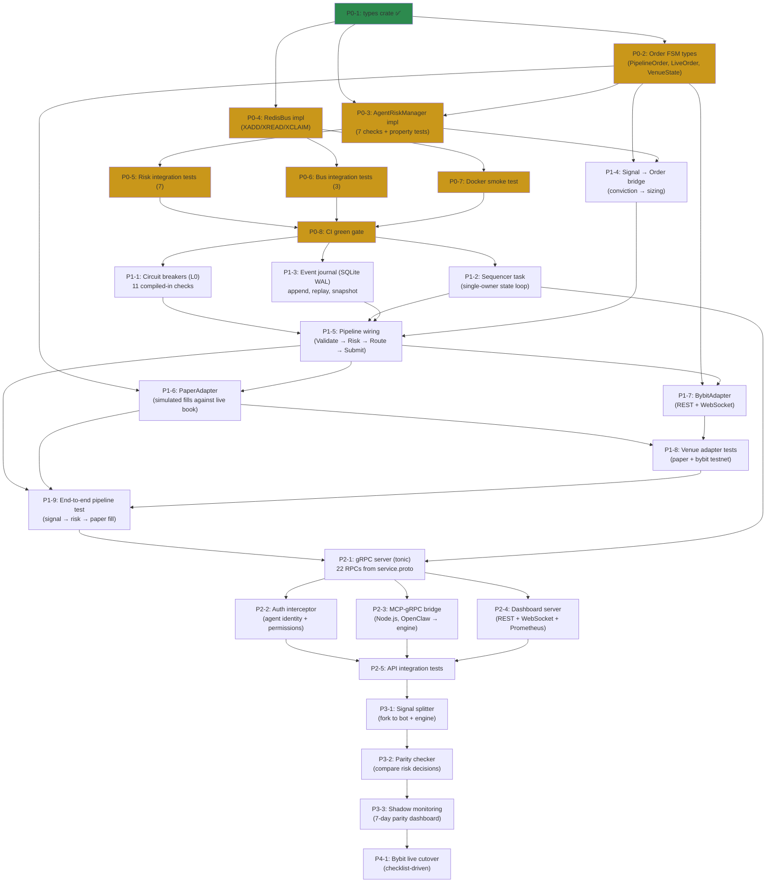

# Feynman Engine — Roadmap & Sprint Plan

**Created:** 2026-03-18
**Status:** Active — used to generate GitHub issues
**Current Phase:** Phase 0 (Scaffold) ~60% complete

---

## Guiding Principle

**Never risk the live trading system.** The engine is built and validated in parallel. The trading bot continues operating throughout — this is a parallel build, not a rewrite-in-place. Cutover happens only after shadow mode proves parity for 7 consecutive days. The trading bot can always be rolled back to.

**The trading bot is never modified to accommodate the engine.** The MCP-gRPC bridge is a separate process. If the engine fails, remove the bridge and the trading bot works exactly as before.

---

## Parallel Work Matrix

| While... | What can proceed simultaneously |
|----------|---------------------------------|
| Phase 0 (scaffold) | Trading bot continues live trading toward Gate 1 |
| Phase 1 (core pipeline) | Trading bot is live; engine has no exchange connectivity yet |
| Phase 2 (API surface) | Trading bot is live; engine API tested against paper mode |
| Phase 3 (shadow mode) | Trading bot is live AND engine processes signals in paper |
| Phase 4 (cutover) | Trading bot halted; engine takes over |

---

## Dependency Graph (High-Level)



---

## Sprint Plan

### Sprint 0: Foundation Complete (Phase 0 remainder)

**Goal:** All foundational crates have working implementations with tests. CI green.
**Duration:** ~2 weeks
**Predecessor:** types crate (done)

| Issue | Title | Crate | Blocked By | Est | Labels |
|-------|-------|-------|-----------|-----|--------|
| P0-2 | Order FSM types: `PipelineOrder<S>`, `LiveOrder`, `VenueState`, `FillSummary`, `RejectedOrder` | `types` | P0-1 (done) | 3d | `types`, `priority-p0` |
| P0-3 | `AgentRiskManager` implementation (7 checks + path-aware evaluation) | `risk` | P0-2 | 3d | `risk`, `priority-p0` |
| P0-4 | `RedisBus` implementation (XADD, XREAD, XPENDING, XCLAIM, consumer groups) | `bus` | P0-1 (done) | 3d | `bus`, `priority-p0` |
| P0-5 | Risk integration tests (7 path-aware scenarios + proptest) | `risk` | P0-3 | 2d | `risk`, `testing` |
| P0-6 | Bus integration tests (pub/sub round-trip, redelivery, claim) | `bus` | P0-4 | 2d | `bus`, `testing` |
| P0-7 | Docker smoke test (`docker compose up` → health check) | `infra` | P0-4 | 1d | `infra` |
| P0-8 | CI green gate (all tests + clippy + fmt pass on push) | `infra` | P0-5, P0-6, P0-7 | 1d | `infra` |

**Parallelism:** P0-2 and P0-4 can run in parallel. P0-3 depends on P0-2. P0-5/P0-6/P0-7 are independent once their predecessor ships.

```
Week 1:  [P0-2: Order FSM types]──────────►[P0-3: Risk impl]──────►
         [P0-4: RedisBus impl]─────────────►[P0-6: Bus tests]──────►
Week 2:                                     [P0-5: Risk tests]─────►[P0-8: CI gate]
                                            [P0-7: Docker smoke]────►
```

**Exit criteria:** `make check` passes. All 7 risk tests + 3 bus tests green. Docker health check passes.

---

### Sprint 1: Core Pipeline (Phase 1A)

**Goal:** Orders flow through the full pipeline: validate → risk → route → submit (paper). State persisted via journal.
**Duration:** ~3 weeks
**Predecessor:** Sprint 0

| Issue | Title | Crate | Blocked By | Est | Labels |
|-------|-------|-------|-----------|-----|--------|
| P1-1 | Circuit breakers (L0): 11 compiled-in checks (CB-1 through CB-11) | `risk` | P0-8 | 3d | `risk`, `safety` |
| P1-2 | Sequencer task: single-owner state loop, priority channels, poison handling | `engine-core` | P0-8 | 5d | `engine-core`, `concurrency`, `priority-p0` |
| P1-3 | Event journal: `SqliteJournal` (append, replay, snapshot, crash recovery) | `engine-core` | P0-8 | 4d | `engine-core`, `persistence` |
| P1-4 | Signal → Order bridge: conviction-based sizing, venue routing, `PipelineOrder<Draft>` construction | `gateway` | P0-2, P0-3 | 4d | `gateway` |
| P1-5 | Pipeline wiring: type-state transitions through Sequencer (Draft → Validated → RiskChecked → Routed → LiveOrder) | `engine-core`, `gateway` | P1-1, P1-2, P1-3, P1-4 | 5d | `engine-core`, `gateway`, `priority-p0` |

**Parallelism:** P1-1, P1-2, P1-3, P1-4 are all independent — work on all four simultaneously. P1-5 is the integration point that wires them together.

```
Week 3:  [P1-1: Circuit breakers]──────►
         [P1-2: Sequencer]──────────────────────►
         [P1-3: Journal]───────────────────►
         [P1-4: Signal bridge]─────────────►
Week 4-5:                                       [P1-5: Pipeline wiring]──────────────►
```

---

### Sprint 2: Venue Adapters (Phase 1B)

**Goal:** Engine can submit orders to paper and Bybit testnet.
**Duration:** ~2 weeks
**Predecessor:** P1-5 (pipeline wired)

| Issue | Title | Crate | Blocked By | Est | Labels |
|-------|-------|-------|-----------|-----|--------|
| P1-6 | `PaperAdapter`: simulated fills against live orderbook (WebSocket data feed, `FillSimulator`) | `gateway` | P1-5 | 5d | `gateway`, `venue` |
| P1-7 | `BybitAdapter`: REST order submission + WebSocket fills/orderbook (testnet first) | `gateway` | P1-5 | 5d | `gateway`, `venue` |
| P1-8 | Venue adapter tests: paper round-trip, Bybit testnet submission, fill reconciliation | `gateway` | P1-6, P1-7 | 3d | `gateway`, `testing` |
| P1-9 | End-to-end pipeline test: signal → risk → paper fill → position update → journal | all | P1-8 | 3d | `integration`, `testing`, `priority-p0` |

**Parallelism:** P1-6 and P1-7 can run in parallel.

```
Week 5-6: [P1-6: PaperAdapter]────────────►[P1-8: Adapter tests]──►[P1-9: E2E test]
          [P1-7: BybitAdapter]─────────────►
```

**Exit criteria:** `cargo test --workspace` passes. Signal-to-fill round-trip works in paper mode. Bybit testnet order submission works. Journal records all events.

---

### Sprint 3: API Surface (Phase 2)

**Goal:** External clients can talk to the engine via gRPC. Dashboard shows portfolio state.
**Duration:** ~3 weeks
**Predecessor:** Sprint 2

| Issue | Title | Crate | Blocked By | Est | Labels |
|-------|-------|-------|-----------|-----|--------|
| P2-1 | gRPC server: tonic codegen from `service.proto`, wire 22 RPCs to Sequencer commands | `api` | P1-9 | 5d | `api`, `grpc`, `priority-p0` |
| P2-2 | Auth interceptor: agent identity from metadata, per-RPC access control | `api` | P2-1 | 3d | `api`, `security` |
| P2-3 | MCP-gRPC bridge: Node.js process, MCP tool → gRPC mapping, signal forwarding | external | P2-1 | 5d | `bridge` |
| P2-4 | Dashboard server: axum REST + WebSocket SSE + Prometheus `/metrics` | `observability` | P2-1 | 5d | `observability` |
| P2-5 | API integration tests: submit signal via gRPC, verify fill stream, verify portfolio state | `api` | P2-2, P2-3 | 3d | `api`, `testing` |

**Parallelism:** P2-2, P2-3, P2-4 are independent once P2-1 is done.

```
Week 7-8:  [P2-1: gRPC server]───────────────────►
Week 8-9:                                          [P2-2: Auth]──────►[P2-5: API tests]
                                                   [P2-3: MCP bridge]──────────►
                                                   [P2-4: Dashboard]───────────►
```

---

### Sprint 4: Shadow Mode (Phase 3)

**Goal:** Engine runs alongside trading bot, receives same signals, compares decisions. 7 days of >99% parity before cutover.
**Duration:** ~3 weeks
**Predecessor:** Sprint 3

| Issue | Title | Crate | Blocked By | Est | Labels |
|-------|-------|-------|-----------|-----|--------|
| P3-1 | Signal splitter: fork signals to both trading bot and engine (via MCP bridge) | external | P2-5 | 3d | `shadow` |
| P3-2 | Parity checker: compare risk decisions, sizing, approval rates between bot and engine | `observability` | P3-1 | 5d | `shadow`, `observability` |
| P3-3 | Shadow monitoring: 7-day parity dashboard, divergence alerts, exit criteria tracking | `observability` | P3-2 | 5d | `shadow`, `observability` |

**Parity criteria (all must hold for 7 consecutive days to exit):**

| Metric | Threshold | How Measured |
|--------|-----------|-------------|
| Risk gate agreement | >99% identical approve/reject | Compare per-signal decisions |
| Position sizing | Within 1% | Compare notional_usd |
| Phantom orders | Zero | Engine never submits real orders in shadow mode |
| Missed signals | Zero | Every bot signal also processed by engine |
| Portfolio state alignment | Within $10 | Compare FirmBook snapshots |
| Reconciliation drift | < 0.1% | End-of-day position reconciliation |

---

### Sprint 5: Cutover (Phase 4)

**Goal:** Engine handles live Bybit orders. Trading bot executor decommissioned.
**Duration:** 1 day (checklist-driven)
**Predecessor:** Sprint 4 exit criteria met

| Issue | Title | Crate | Blocked By | Est | Labels |
|-------|-------|-------|-----------|-----|--------|
| P4-1 | Bybit live cutover: halt bot → verify clean state → engine live → test signal → resume | ops | P3-3 | 1d | `cutover`, `priority-p0` |

**Cutover procedure:**

```
Human (Feynman CIO)
  1. Halt all trading bot agents (kill switch L2)
  2. Verify clean state — no open orders
  3. Set engine: execution_mode = live, dry_run = false
  4. Verify engine health check passes
  5. Submit test signal (small size)
  6. Verify fill, position, P&L correct on Bybit
  7. Resume normal operation
  8. Decommission trading bot executor MCP
```

**Rollback (if anything goes wrong):**
1. `HaltAll` RPC on engine
2. Cancel all engine-placed orders on Bybit
3. Re-enable trading bot executor
4. Log failure to `memory/anti-patterns.md`

---

### Sprint 6: Backtest Engine (Phase 5)

**Goal:** Engine supports backtest mode — replay historical data through the identical pipeline. Same strategy code works in all three modes.
**Duration:** ~2 weeks
**Predecessor:** Sprint 5 (live for ≥30 days, Gate 2)
**Gate Alignment:** Gate 2 (30d positive P&L)

| Issue | Title | Crate | Blocked By | Est | Labels |
|-------|-------|-------|-----------|-----|--------|
| P5-1 | `SimulatedVenue` adapter: replay fills from historical data | `gateway` | P4-1 | 5d | `gateway`, `venue` |
| P5-2 | `SimulatedClock`: deterministic time control for backtest replay | `engine-core` | P4-1 | 3d | `engine-core` |
| P5-3 | Backtest runner: load historical data, drive clock, collect results | `engine-core` | P5-1, P5-2 | 4d | `engine-core` |
| P5-4 | Backtest E2E: verify same strategy produces same results as paper mode | all | P5-3 | 3d | `integration`, `testing` |

---

### Sprint 7: Multi-Venue (Phase 6)

**Goal:** Add additional venue adapters beyond Bybit.
**Duration:** ~3 weeks per venue
**Predecessor:** Sprint 6
**Gate Alignment:** Gate 3 → Gate 4

Each new venue follows the same pattern:
1. Implement `VenueAdapter` trait (sealed)
2. Add venue config section + risk limits
3. Integration test against testnet
4. Shadow mode against venue
5. Cutover

Planned venues (in order):

| Venue | Type | Gate |
|-------|------|------|
| Binance | Spot + Perps | Gate 3 |
| Hyperliquid | Perps | Gate 3 |
| Polymarket | Prediction markets | Gate 3 |
| IBKR | Equities | Gate 4 |
| Deribit | Options | Gate 4 |

---

## Issue Dependency Graph (Compact)

```
P0-2 ──┬──► P0-3 ──► P0-5 ──┐
       │                      ├──► P0-8 ──┬──► P1-1 ──┐
P0-4 ──┴──► P0-6 ──┐         │           ├──► P1-2 ──┤
              P0-7 ──┘────────┘           ├──► P1-3 ──┤
                                          └──► P1-4 ──┘
                                                │
                                            P1-5 ──┬──► P1-6 ──┐
                                                   └──► P1-7 ──┤
                                                                ├──► P1-8 ──► P1-9
                                                                │
                                                            P2-1 ──┬──► P2-2 ──┐
                                                                   ├──► P2-3 ──┤
                                                                   └──► P2-4   ├──► P2-5
                                                                               │
                                                                           P3-1 ──► P3-2 ──► P3-3 ──► P4-1
```

---

## Critical Path

The longest dependency chain determines the minimum calendar time:

```
P0-2 → P0-3 → P0-5 → P0-8 → P1-2 → P1-5 → P1-9 → P2-1 → P2-5 → P3-1 → P3-3 → P4-1
 3d     3d      2d     1d     5d      5d      3d      5d     3d      3d      5d      1d
                                                                            = ~39 working days
                                                                            + 21 days shadow parity
```

**~12 weeks to cutover** (assuming single contributor, no parallelism).
**~8 weeks to cutover** (with 2 contributors parallelizing independent tracks).

---

## Risk Items

| Risk | Impact | Mitigation | Owner |
|------|--------|-----------|-------|
| Bybit testnet API differs from production | Rework adapter | Pin API version, test on testnet early (P1-7) | Sprint 2 |
| Shadow mode reveals systematic divergence | +1-2 weeks to Phase 3 | Budget 3 weeks for shadow; fix root causes before cutover | Sprint 4 |
| Redis Streams availability in production | Bus unavailable | In-memory fallback queue for graceful degradation | P0-4 |
| Sequencer becomes bottleneck | Throughput ceiling | Profile in P1-2; priority channels prevent starvation | Sprint 1 |
| Type-state adds compilation complexity | Slower iteration | Start with P0-2; if ergonomics are bad, simplify before P1-5 | Sprint 0 |

---

## GitHub Labels

Phases are **milestones** (not labels). Labels are for cross-cutting concerns:

| Label | Description |
|-------|-------------|
| `priority-p0` | Critical path — blocks everything downstream |
| `risk` | Risk evaluation code |
| `safety` | Safety-critical (circuit breakers, kill switches) |
| `types` | Domain type definitions |
| `bus` | Message bus / Redis Streams |
| `gateway` | Venue adapters / execution gateway |
| `engine-core` | Sequencer / state management |
| `api` | gRPC service |
| `observability` | Metrics / dashboard / tracing |
| `testing` | Test coverage |
| `infra` | Docker / CI / CD |
| `venue` | Exchange-specific adapter |
| `concurrency` | Async / channels / Sequencer |
| `persistence` | Journal / snapshots / state store |
| `shadow` | Shadow mode / parity checking |
| `bridge` | MCP-gRPC bridge |
| `cutover` | Live cutover procedure |
| `security` | Auth / permissions |
