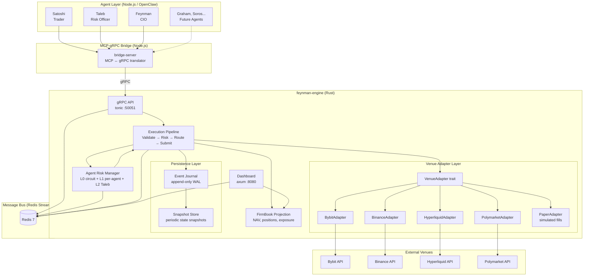
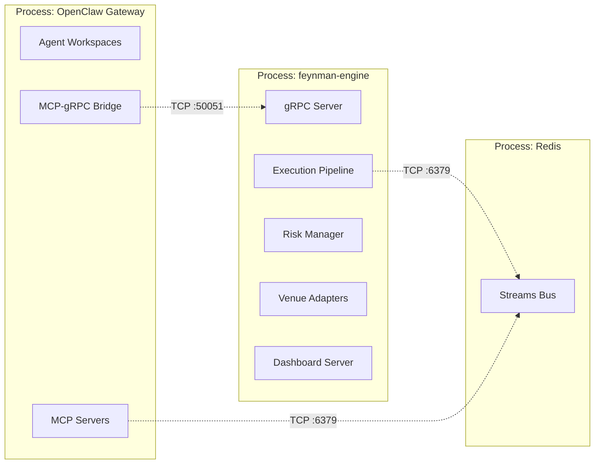
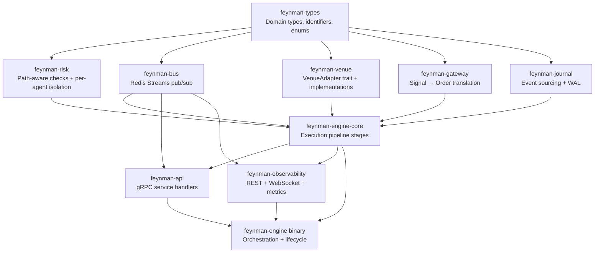
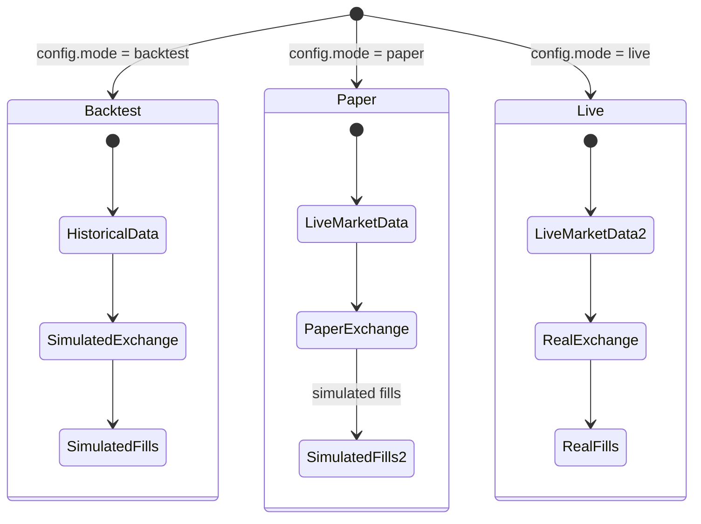
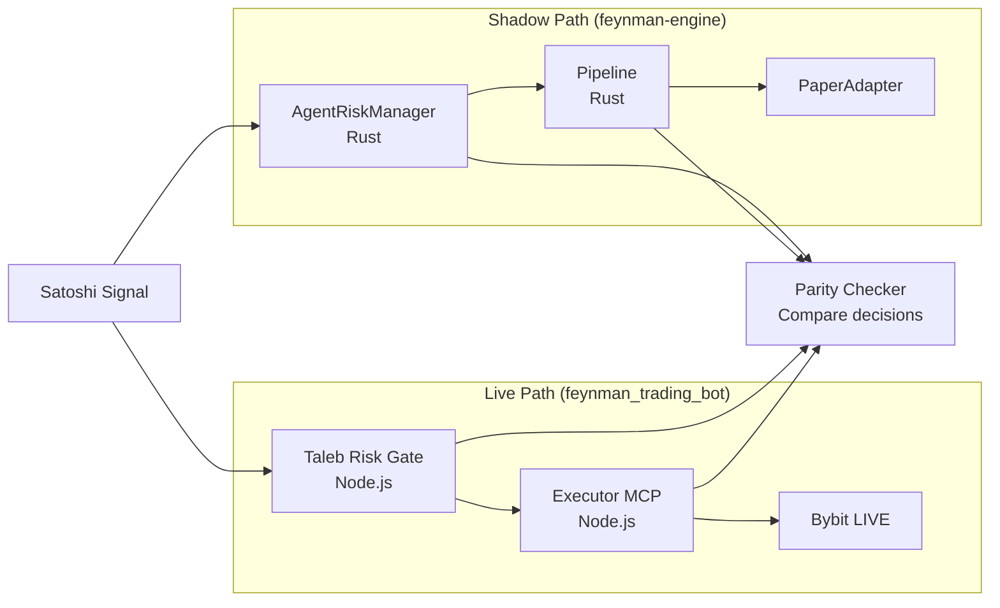
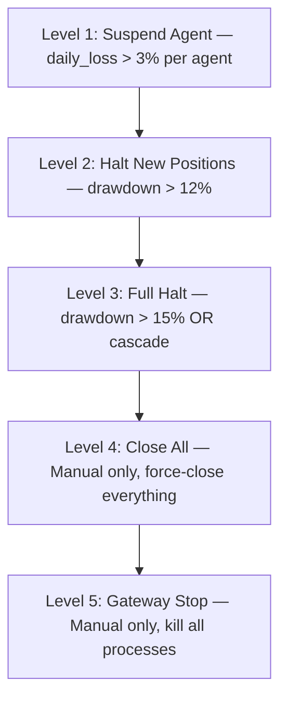

# Feynman Engine — System Architecture

**Version:** 2.1.0
**Status:** Architecture Review Complete
**Last Updated:** 2026-03-19

---

## 1. Design Philosophy

### 1.1 Core Principle: Custom Rust Engine

The engine is **100% custom Rust** using per-exchange client crates for venue connectivity. NautilusTrader was evaluated and rejected on 2026-03-17 (see `HYBRID_ENGINE_ARCHITECTURE.md` for the evaluation record).

**Implication:** Every interface is defined in Feynman-native types with custom implementations. The calling code targets Feynman traits — venue adapters, risk gates, and pipeline stages are all Feynman-owned.

```
                    ┌─────────────────────┐
                    │  Feynman Interfaces  │  ← All crates code to these
                    │  (traits + types)    │
                    └──────────┬──────────┘
                               │
               ┌───────────────┼───────────────┐
               │               │               │
        ┌──────▼──────┐ ┌─────▼──────┐ ┌──────▼──────┐
        │  Live Venue  │ │  Paper     │ │  Mock       │
        │  Adapters    │ │  Adapter   │ │  Backend    │
        │  (per-venue) │ │  (sim fills)│ │  (testing)  │
        └─────────────┘ └────────────┘ └─────────────┘
```

### 1.2 Non-Negotiable Invariants

These are inherited from the trading bot and **cannot be violated**:

| # | Invariant | Source |
|---|-----------|--------|
| 1 | **3-hop minimum execution path**: Agent → Risk Gate → Executor → Venue | SOLUTION-DESIGN.md |
| 2 | **Risk gate is fail-closed**: if risk evaluation errors, order is rejected | ARCHITECTURE.md |
| 3 | **No state mutation before venue confirmation** | CLAUDE.md |
| 4 | **dryRun = true by default** at every layer | CLAUDE.md |
| 5 | **Per-agent budget isolation**: one agent's loss never affects another | MVP.md |
| 6 | **Decimal only** for all financial math | CLAUDE.md |
| 7 | **Bus is the source of truth** for inter-component coordination | SOLUTION-DESIGN.md |

### 1.3 Design Goals

| Priority | Goal | Measure |
|----------|------|---------|
| P0 | **Safety** | Zero unintended trades. Risk gate cannot be bypassed. |
| P1 | **Correctness** | Position state matches venue state within 1 reconciliation cycle. |
| P2 | **Autonomy** | Agents operate 24/7 without human intervention (except halt). |
| P3 | **Backtest parity** | Same strategy code in backtest and live produces equivalent results. |
| P4 | **Multi-venue** | Add a new venue without changing pipeline or risk logic. |

---

## 2. System Topology

### 2.1 Deployment View



### 2.2 Process Boundary



**Key boundary rule:** Agents (Process 1) never make direct venue API calls. All exchange operations go through Process 2 over gRPC.

---

## 3. Component Architecture

### 3.1 Component Dependency Graph



### 3.2 Component Responsibilities

| Component | Responsibility | Failure Mode |
|-----------|---------------|--------------|
| **feynman-types** | Domain types, identifiers, validation. Zero business logic. | Compile error (caught early) |
| **feynman-risk** | Path-aware risk checks (universal + signal-specific) + per-agent/instrument/venue limits. Deterministic, no I/O. | Fail-closed: reject order on error |
| **feynman-bus** | Redis Streams client. Publish/subscribe/ack. Consumer groups. | Retry with backoff; queue in memory |
| **feynman-venue** | `VenueAdapter` trait (sealed) + venue implementations. Translates orders to venue-native API. Returns `VenueConnectionHealth` (`ConnectionState` 6-variant enum). | Return error to pipeline; no retry at this layer |
| **feynman-gateway** | Signal → Order conversion. Conviction-based sizing. Stop/take-profit mapping. | Reject signal if it can't produce valid order |
| **feynman-engine-core** | Orchestrates: Validate → Risk → Route → Submit. Enforces stage ordering. | Reject order if any stage fails |
| **feynman-journal** | Append-only event log. WAL for crash recovery. Snapshot/restore. | Engine refuses to start if journal corrupted |
| **feynman-api** | gRPC handlers. Request validation. Auth (which agent is calling). | Return gRPC status codes; never panic |
| **feynman-observability** | HTTP REST + WebSocket SSE + Prometheus metrics. Read-only. | Degrade gracefully; engine continues without dashboard |
| **feynman-engine** | Binary. Config loading, component wiring, lifecycle management, shutdown. | Graceful shutdown: drain orders, snapshot state, cancel pending |

---

## 4. Execution Modes

The engine operates in one of three modes. The mode is set at startup and affects venue adapter selection.



| Mode | Market Data | Order Submission | Fill Source | Use Case |
|------|-------------|-----------------|------------|----------|
| **Backtest** | Historical replay | SimulatedExchange | Fill model (best-price, probabilistic) | Strategy development, tuning |
| **Paper** | Live WebSocket | PaperAdapter (no real orders) | Simulated at last price | Pre-deployment validation |
| **Live** | Live WebSocket | Real venue API | Real exchange fills | Production trading |

**Critical:** The execution pipeline is identical across all three modes. Only the `VenueAdapter` implementation changes. Risk checks, position tracking, and event journaling run in all modes.

```rust
/// Execution mode determines which VenueAdapter implementation is used.
/// Pipeline logic, risk checks, and journaling are identical across all modes.
pub enum ExecutionMode {
    Backtest,
    Paper,
    Live,
}
```

---

## 5. Parallel Development: Coexistence with feynman_trading_bot

### 5.1 Migration Timeline

```mermaid
gantt
    title Parallel Development Timeline
    dateFormat YYYY-MM-DD
    axisFormat %b %d

    section feynman_trading_bot
    MVP Trading (Satoshi on Bybit)       :active, bot1, 2026-03-17, 60d
    Gate 1: 50 closed trades             :milestone, g1, 2026-05-01, 0d
    Gate 2: 30d positive P&L             :milestone, g2, 2026-06-15, 0d

    section feynman-engine
    Phase 0: Scaffold (types + risk + bus) :active, eng0, 2026-03-17, 14d
    Phase 1: Core Pipeline (FSM + adapters):eng1, after eng0, 21d
    Phase 2: gRPC API + MCP Bridge       :eng2, after eng1, 14d
    Phase 3: Shadow Mode (parallel run)  :eng3, after eng2, 21d
    Phase 4: Cutover (Bybit only)        :milestone, eng4, after eng3, 0d

    section Integration Points
    MCP Bridge connects both systems     :int1, after eng2, 7d
    Shadow mode parity checks            :int2, after eng3, 14d
```

### 5.2 Shadow Mode Architecture

During Phase 3, both systems run simultaneously. The trading bot continues to trade live; the engine receives the same signals but submits to paper mode only. Parity checks compare decisions.



**Parity criteria for cutover:**
- Risk gate produces identical approve/reject decisions for >99% of signals
- Position sizing within 1% tolerance
- No missed fills, no phantom orders
- Dashboard shows equivalent portfolio state

### 5.3 Bus Coexistence

During parallel development, two bus systems coexist:

| Bus | System | Technology | Role |
|-----|--------|-----------|------|
| **SQLite Bus** | feynman_trading_bot | SQLite WAL | Live signal routing (current production) |
| **Redis Streams** | feynman-engine | Redis 7 | Engine-internal events + shadow signal feed |

The MCP-gRPC bridge (Phase 2) subscribes to SQLite bus topics and forwards relevant messages to the engine over gRPC. In shadow mode, both systems see the same signals.

---

## 6. Kill Switch Hierarchy

Inherited from feynman_trading_bot and enforced in the engine:



| Level | Trigger | Engine Action |
|-------|---------|--------------|
| 1 | Agent daily loss > 3% | Set `AgentStatus::Paused`, reject new orders for that agent |
| 2 | Firm drawdown > 12% | Reject all `SubmitSignal` RPCs, publish `risk_events.halt_new` |
| 3 | Firm drawdown > 15% | Cancel all pending orders, reject everything, publish `risk_events.full_halt` |
| 4 | Manual directive | Close all open positions via venue adapters |
| 5 | Manual | `SIGTERM` → graceful shutdown with drain |

---

## 7. Technology Decisions

| Concern | Choice | Rationale |
|---------|--------|-----------|
| Language | Rust (edition 2021) | Performance, type safety, fearless concurrency |
| Async runtime | tokio | Industry standard for Rust async |
| gRPC | tonic + prost | Fastest Rust gRPC with code generation |
| HTTP | axum | tokio-native, composable, tower middleware |
| Redis client | fred | tokio-native, cluster-ready, pipelining |
| Financial math | rust_decimal | Exact decimal arithmetic, serde support |
| Error handling | anyhow + thiserror | anyhow in bins/integration, thiserror in library error types |
| Serialization | serde + serde_json | Standard Rust serde ecosystem |
| Testing | built-in + proptest | Property-based testing for risk logic |
| Observability | tracing + prometheus-client | Structured logging + metrics export |
| Config | toml (via config crate) | Human-readable, layered config |
| Database | SQLite (now) → PostgreSQL (Gate 3+) | Simple start, upgrade when multi-node |

---

## 8. Open Decisions

These are explicitly deferred and will be resolved during implementation:

| Decision | Options | Resolve By |
|----------|---------|-----------|
| ~~NautilusTrader Rust-only viability~~ | **Rejected** (2026-03-17). Custom Rust engine. | Resolved |
| Event journal format | Custom binary / MessagePack / Protobuf | Phase 1b |
| Multi-venue order routing | Round-robin / best-price / manual | Phase 4 (multi-venue) |
| PostgreSQL migration timing | Gate 2 / Gate 3 / Gate 4 | When concurrent write pressure appears |
| Dashboard frontend | Minimal HTML / React / external (Grafana) | Phase 6 |

---

## Document Index

| Document | Purpose | Audience |
|----------|---------|----------|
| **SYSTEM_ARCHITECTURE.md** (this) | System topology, components, deployment, modes | Everyone |
| **CONTRACTS.md** | Traits, interfaces, gRPC proto, data contracts | Developers |
| **DATA_MODEL.md** | Type definitions, state machines, invariants | Developers |
| **MIGRATION_PLAN.md** | Phased migration with gates, risks, fallbacks | Project planning |
| HYBRID_ENGINE_ARCHITECTURE.md | ~~DEPRECATED~~ — NautilusTrader evaluation (rejected 2026-03-17, kept for history) | Reference only |
| **CORE_ENGINE_DESIGN.md** | Canonical architecture: types, venues, pipeline, risk, concurrency | Developers |
